# Final Product Specification — X Protocol Research + Production Ingestion Platform

> **Status:** Canonical product-level specification synthesized from the active documentation and research in:
>
> - `ahansardar/x-scraper`
> - `techtiesai-png/X-rev-os`
> - `techtiesai-png/XINGESTIONV2`
>
> This document explains the **complete intended product**. It does not replace repository-specific implementation ledgers or detailed subsystem architecture documents. Where an older idea conflicts with the active `X-rev-os` or `XINGESTIONV2` standing documents, the newer active architecture wins.
>
> The product must only operate with accounts, sessions, data, and network access the operator is authorized to use. It must not include credential theft, account takeover, CAPTCHA/challenge bypass, or access-control circumvention.

---

# 1. Executive Summary

The final product is **not merely an X/Twitter scraper**.

It is a complete, evidence-driven ingestion platform with two major active subsystems:

1. **X-rev-os**
   - researches and understands X's observable web protocol;
   - captures authorized browser/network evidence;
   - identifies operation/request behavior;
   - builds first-party request, parsing, and pagination logic;
   - validates exact protocol compositions;
   - exports versioned, approved protocol releases.

2. **XINGESTIONV2**
   - exposes stable product capabilities;
   - manages durable tasks and workers;
   - owns all production retries;
   - manages accounts, sessions, and network allocation;
   - persists raw production evidence;
   - normalizes data into canonical models;
   - handles monitoring, analytics, APIs, and parent-system integration;
   - pins and deploys approved X-rev releases.

The original `x-scraper` repository remains useful as the **historical research/prototype origin**. Many of its concepts survive, but several have been formalized into stronger abstractions in X-rev-os and XINGESTIONV2.

---

# 2. Why the Product Is Split into Two Active Repositories

The two-repository structure is intentional.

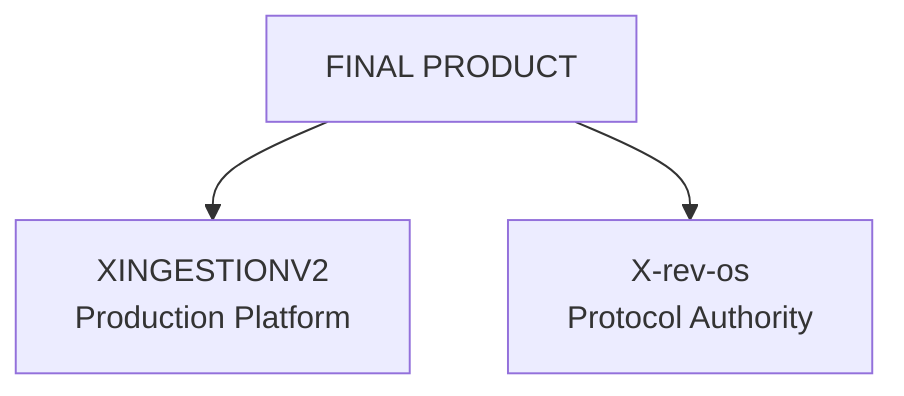

The two systems change at different speeds.

X protocol behavior may change frequently:

- operation IDs;
- feature bundles;
- request metadata;
- response variants;
- pagination behavior;
- auth attachment semantics;
- client-side transaction metadata.

The production control plane should not need to change every time one of those protocol details changes.

Likewise, protocol researchers should not need to touch:

- PostgreSQL task state;
- Redis delivery;
- retry generations;
- session leases;
- analytics;
- APIs;
- production data models.

Therefore:

> **X-rev-os owns X-specific protocol behavior. XINGESTIONV2 owns production ingestion and orchestration.**

There must be only one canonical implementation of X-specific request construction, parsing, pagination, and related protocol logic.

---

# 3. Historical Role of `x-scraper`

`x-scraper` established the original research direction.

Its important ideas include:

- use authenticated structured web/GraphQL responses rather than DOM scraping for the primary data path;
- isolate endpoint-specific logic;
- manage authenticated sessions;
- detect authentication failures separately from endpoint/schema failures;
- classify failures;
- normalize raw responses;
- isolate pagination logic;
- retain debug/raw responses;
- monitor request/response changes;
- use regression fixtures and contract tests;
- build observability around the collection layer.

These ideas remain valid.

However, some original abstractions are superseded.

## 3.1 Superseded: simple Endpoint Registry

Old concept:

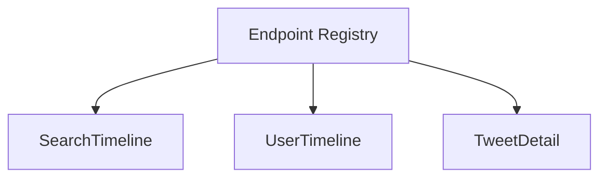

Final concept:

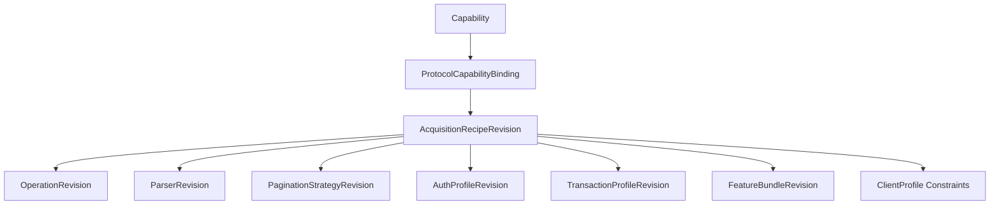

Why this is better:

An endpoint can remain unchanged while its parser changes. A parser can remain unchanged while pagination changes. Authentication behavior can change independently from the GraphQL operation.

A single endpoint version is therefore too coarse.

---

# 4. Final Whole-System Architecture

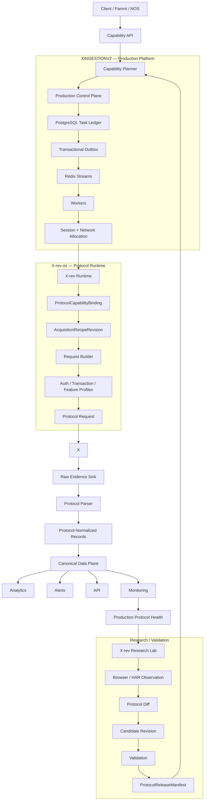

---

# 5. Stable Product Capabilities

Production clients must request **capabilities**, not X endpoint names.

Examples:

```text
SEARCH_TWEETS
TWEET_BY_ID
TWEET_REPLIES
TWEET_QUOTES
USER_LOOKUP
USER_TIMELINE
FOLLOWERS
FOLLOWING
LIST_TIMELINE
COMMUNITY_TIMELINE
MONITOR_QUERY
MONITOR_USER
```

A capability defines **what the caller needs**, not how X currently provides it.

Example:

```text
Capability: SEARCH_TWEETS
Contract version: 1

Inputs:
- query
- product
- cursor
- page_size

Expected behavior:
- real tweet IDs
- text
- author
- timestamps
- supported engagement metadata
- opaque pagination cursor
- acquisition provenance
```

The capability contract must not contain:

- X GraphQL operation IDs;
- X request URLs;
- feature flag bundles;
- parser implementation details;
- cookies;
- CSRF tokens;
- browser selectors;
- Twikit or twscrape types.

This allows the X protocol implementation to change without breaking the client-facing API.

---

# 6. Capability Planner

The `CapabilityPlanner` converts a stable `CapabilityRequest` into an executable production plan.

Conceptually:

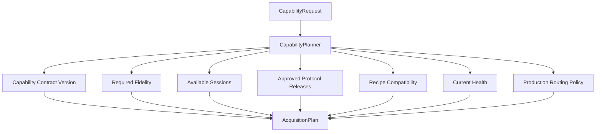

An `AcquisitionPlan` should identify:

- capability ID;
- contract version;
- approved X-rev release;
- acquisition recipe revision;
- required auth class;
- cursor/page policy;
- traffic priority;
- production routing information.

The planner does **not** contain cookies, passwords, or raw X operation definitions.

---

# 7. Production Control Plane

The production control plane is owned entirely by XINGESTIONV2.

Its job is to guarantee that ingestion work is:

- durable;
- recoverable;
- auditable;
- retryable;
- scalable;
- crash-safe.

## 7.1 PostgreSQL is the durable authority

PostgreSQL is the source of truth for task state.

Tasks are not considered real merely because they appear in Redis.

Typical states include:

```text
CREATED
ENQUEUED
RUNNING
RETRY_SCHEDULED
DONE
DEAD_LETTER
```

## 7.2 Transactional outbox

A task and its publication intent are committed atomically.

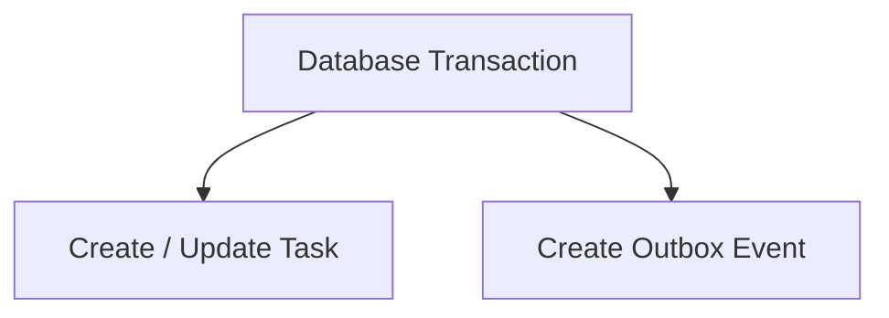

A dispatcher later publishes the outbox event to Redis Streams.

This prevents the classic failure:

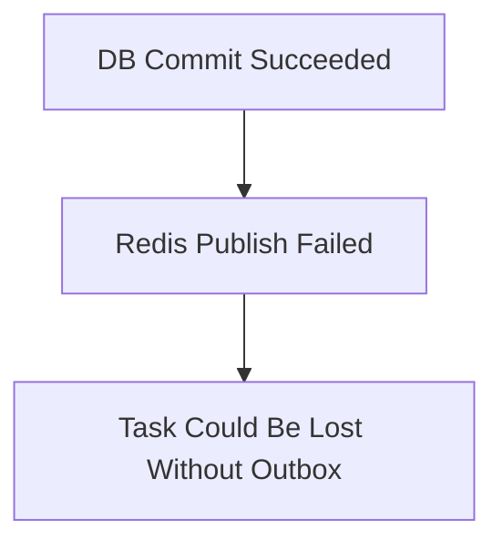

## 7.3 Redis Streams

Redis is delivery infrastructure.

It provides:

- consumer groups;
- pending messages;
- worker distribution;
- reclaim behavior.

It is **not** the authoritative task database.

## 7.4 Worker leases

Workers do not simply "take a task forever".

A worker obtains a lease.

The lease must be renewed through heartbeat logic.

If a worker dies:

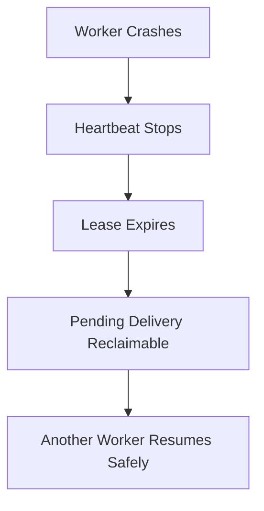

## 7.5 Fencing

A stale worker must not be able to commit after losing ownership.

All writes must be fenced by task identity, delivery generation, lease owner/token, and valid task state.

---

# 8. Retry Ownership

This rule is critical:

> **XINGESTIONV2 exclusively owns production retries.**

The X-rev production runtime performs **zero automatic retries**.

Why:

If XINGESTION allows 5 task attempts and X-rev secretly retries each request 3 times:

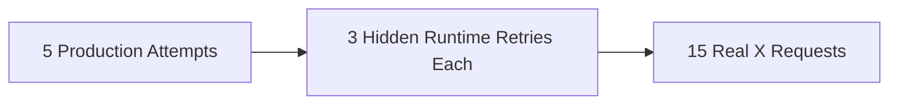

This destroys visibility and pacing control.

Instead:

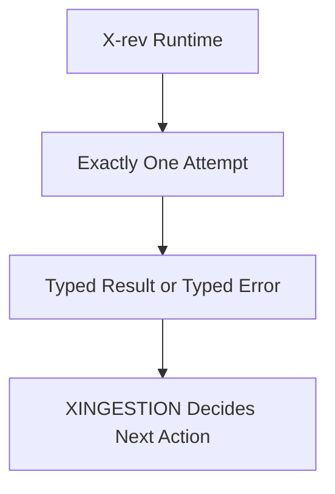

Typed error metadata can include:

```text
retry_disposition = NEVER
retry_disposition = MAY_RETRY
retry_disposition = RETRY_AFTER
retry_after = ...
scope_hint = SESSION / OPERATION / SHARED / UNKNOWN
```

XINGESTION applies durable scheduling, backoff, jitter, retry generations, and attempt limits.

---

# 9. Dead-Letter and Replay

When retry attempts are exhausted:

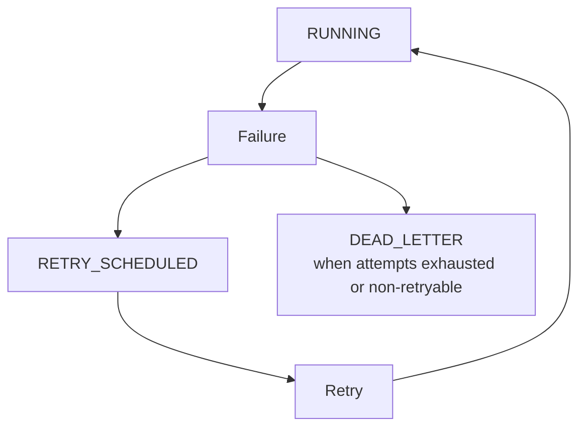

Dead-letter records must preserve:

- original task ID;
- failure class;
- attempts;
- delivery generation;
- protocol provenance;
- timestamps;
- safe diagnostic metadata.

Replay must be:

- selective;
- explicit;
- auditable;
- lineage-preserving.

A replayed task is a new task linked to its dead-letter origin.

---

# 10. Account, Credential, Session, and Network Model

These concepts must remain separate.

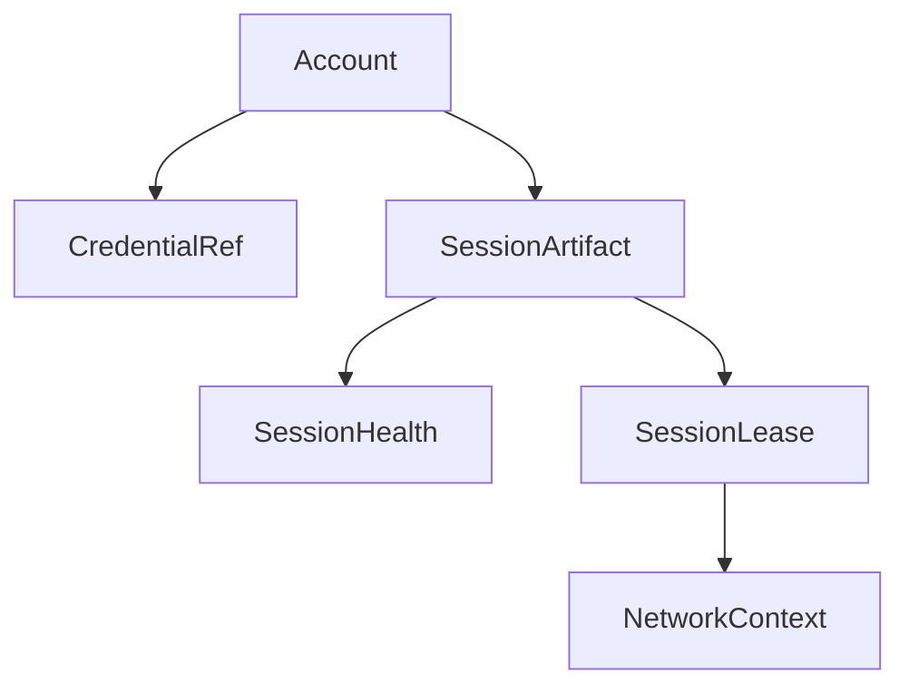

## 10.1 Account

Non-secret identity metadata for an authorized account.

## 10.2 CredentialRef

A reference to long-lived sensitive material stored in a proper secret backend.

Never place raw secrets in task payloads.

## 10.3 SessionArtifact

Represents usable authenticated session material.

Possible data may include:

- cookies;
- session-specific metadata;
- optional protocol-required authorization material.

The sensitive values remain secret.

## 10.4 SessionHealth

Examples:

```text
HEALTHY
DEGRADED
AUTH_EXPIRED
CHALLENGED
LOCKED
DISABLED
UNKNOWN
```

Health is not the same thing as lease ownership.

## 10.5 SessionLease

Controls temporary production use of a session.

It includes:

- owner;
- expiry;
- concurrency rules;
- fencing token;
- reclaim behavior.

## 10.6 NetworkContext

Represents the network route selected by production.

It may include:

- direct route;
- approved proxy/gateway;
- region;
- transport metadata.

XINGESTION selects the route.

X-rev only receives the provided `NetworkContext`/transport and constructs the X-specific request correctly.

---

# 11. X-rev-os Protocol Model

X-rev-os is not an endpoint list.

It is an evidence-backed protocol dependency system.

Core concepts:

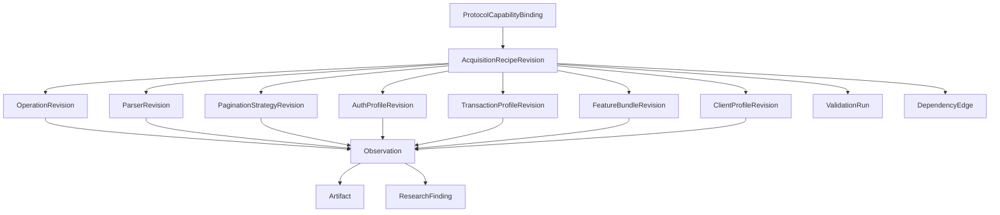

---

# 12. Immutable Revision Model

Research objects can be mutable only while they are explicitly drafts.

Examples:

```text
DraftOperation
DraftRecipe
DraftParser
```

Once published:

```text
OperationRevision
AcquisitionRecipeRevision
ParserRevision
```

they are immutable.

If behavior changes, create a new revision.

This provides reproducibility.

A historical production run should always be able to answer:

```text
Which operation definition?
Which parser?
Which pagination strategy?
Which auth logic?
Which feature bundle?
Which runtime?
Which protocol bundle?
```

---

# 13. Acquisition Recipe

A capability is executed through an `AcquisitionRecipeRevision`.

Example:

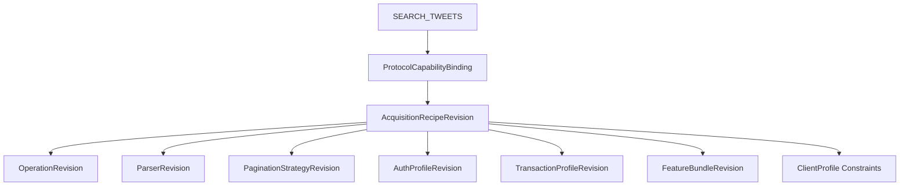

This prevents unrelated protocol components from being incorrectly versioned together.

Example:

If only the parser changes:

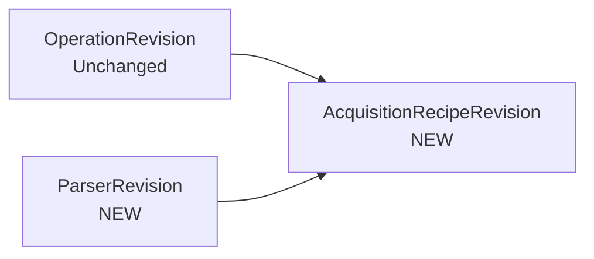

The previous complete-recipe validation does not automatically transfer.

---

# 14. Three Separate State Dimensions

Do not collapse all protocol state into "healthy/unhealthy".

## 14.1 Evidence maturity

Answers:

> How strongly do we know this protocol fact?

```text
REFERENCE
OBSERVED
INFERRED
VALIDATED
```

## 14.2 Validation freshness

Answers:

> How recent is the validation for this exact composition?

```text
NEVER_VALIDATED
CURRENT
AGING
EXPIRED
```

## 14.3 Operational health

Answers:

> What are recent observations telling us operationally?

```text
UNKNOWN
ACTIVE
DEGRADED
STALE
QUARANTINED
RETIRED
```

A recipe can legitimately be:

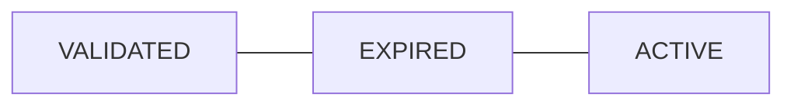

Meaning:

It worked and was previously proven, recent validation is old, but production has not observed a current failure.

---

# 15. Protocol Observation

X-rev researches X through authorized observable behavior.

Observation sources may include:

- browser network traffic;
- HAR exports;
- CDP/browser instrumentation;
- sanitized historical fixtures;
- direct-client captures;
- public client artifact analysis;
- comparison with reference libraries.

The browser is a research tool, not the core production transport.

That is a key architectural decision.

## 15.1 Browser role

Browser/HAR observation helps answer:

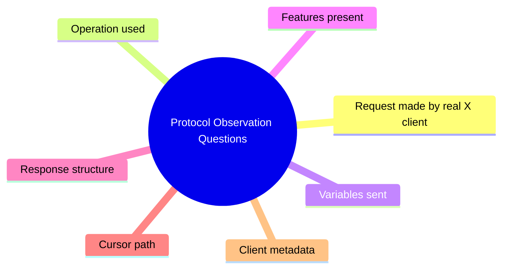

## 15.2 Production role

Production should eventually use the validated first-party X-rev direct runtime rather than launching a research browser for each collection task.

---

# 16. Raw Evidence

Raw evidence is a first-class durability requirement.

## 16.1 Research raw evidence

Owned by X-rev-os.

It remains:

- local;
- gitignored;
- protected from accidental commit.

## 16.2 Production raw evidence

Owned by XINGESTIONV2.

The X-rev runtime receives an injected `RawEvidenceSink`.

Flow:

```mermaid
flowchart TD
    X[X Response] --> R[RawEvidenceSink.store(...)]
    R --> REF[Durable RawEvidenceRef]
    REF --> P[Parser]
    P --> A[AcquisitionResult]
```

If production raw persistence is required and fails:

```text
RAW_EVIDENCE_PERSISTENCE_FAILED
```

The system must not silently declare successful safe acquisition.

---

# 17. Why Raw Evidence Must Be Stored Before Normalization

Suppose the parser has a bug.

Without raw evidence:

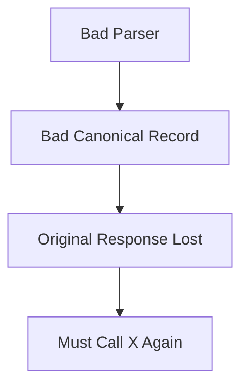

With raw evidence:

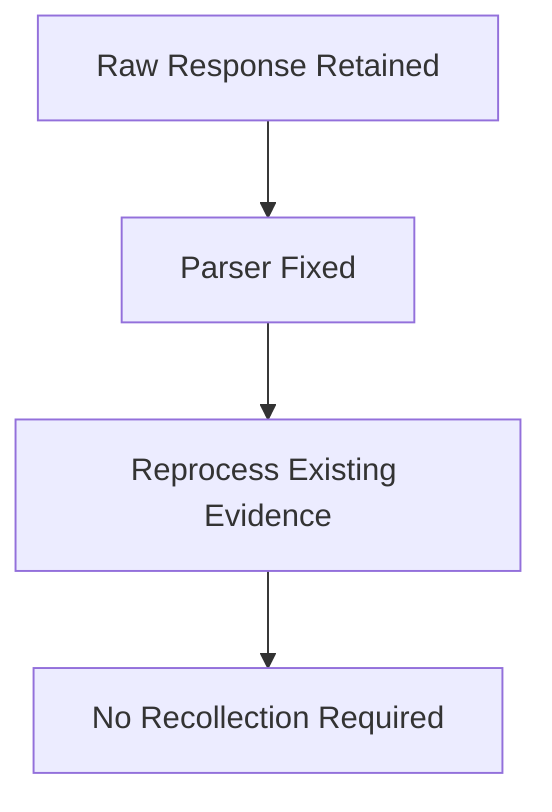

This reduces:

- unnecessary upstream requests;
- cost;
- data loss;
- debugging uncertainty.

---

# 18. Parser and Protocol-Normalized Output

X-rev parses protocol-specific response structures into protocol-normalized capability records.

Example:

```mermaid
flowchart TD
    R[Raw X GraphQL Response] --> P[X-rev Parser]
    P --> N[Protocol-Normalized Tweet Record]
```

Possible fields:

```text
tweet_id
author_id
username
text
created_at
reply_count
repost_count
like_count
quote_count
media
conversation_id
```

XINGESTION then converts these into the larger canonical production data model.

---

# 19. Canonical Data Plane

XINGESTION owns:

```text
canonical entities
relationship edges
time-varying observations
normalization versions
reprocessing
provenance
```

Do not treat everything as a tweet document.

Examples:

```text
Tweet
User
List
Community
RelationshipEdge
EngagementObservation
ProfileObservation
```

## 19.1 Object identity

Platform object IDs are identity.

Text hashes must not be used to destructively merge distinct objects.

## 19.2 Engagement counters

Engagement counts are observations over time.

Do not model:

```text
likes +100
```

as if the platform emitted a guaranteed event.

Instead:

```text
tweet_id = 123
captured_at = T1
likes = 100

tweet_id = 123
captured_at = T2
likes = 160
```

## 19.3 Time semantics

Keep separate:

```text
source_created_at
captured_at
first_seen_at
last_seen_at
source_updated_at
normalized_at
```

---

# 20. Pagination

Pagination belongs to X-rev because cursor meaning is protocol-specific.

XINGESTION treats cursors as opaque values.

Example:

```mermaid
flowchart TD
    P1[Page 1] --> C[X-rev Extracts Next Cursor]
    C --> A[AcquisitionResult.page.next_cursor]
    A --> X[XINGESTION Stores / Passes Opaque Cursor]
    X --> N[Next ProtocolRequest]
```

X-rev validates:

- cursor extraction;
- cursor loops;
- duplicate pages;
- missing cursor;
- empty continuation;
- page semantics.

---

# 21. Typed Protocol Errors

The runtime should provide structured errors such as:

```text
SESSION_INVALID
SESSION_CHALLENGED
AUTH_ATTACHMENT_INVALID
TRANSPORT_TIMEOUT
NETWORK_FAILURE
HTTP_SERVER_FAILURE
RATE_LIMITED
TEMPORARY_UNAVAILABLE
OPERATION_NOT_FOUND
OPERATION_CONTRACT_CHANGED
FEATURE_OR_CONFIG_CHANGED
SHARED_TRANSACTION_PROFILE_CHANGED
CLIENT_BUILD_CHANGED
RESPONSE_SCHEMA_VARIANT
PARSER_FAILURE
PAGINATION_CURSOR_MISSING
PAGINATION_CURSOR_LOOP
PAGINATION_EMPTY_CONTINUATION
RAW_EVIDENCE_PERSISTENCE_FAILED
ACCESS_NOT_AUTHORIZED
OBJECT_NOT_FOUND
UNSUPPORTED_CAPABILITY
BUNDLE_RUNTIME_INCOMPATIBLE
UNKNOWN_PROTOCOL_FAILURE
```

This enables intelligent production behavior without putting protocol-specific implementation inside the worker.

---

# 22. Failure Isolation

The system is not designed around the fantasy that nothing breaks.

X changes.

The target is:

> **A failure should affect only its actual dependency graph.**

Examples:

## One operation changes

```text
SEARCH_TWEETS degraded
USER_TIMELINE unaffected
task database unaffected
analytics unaffected
```

## Parser breaks

```text
raw evidence retained
normalization fails
no need to recollect
```

## One session expires

```text
session quarantined
other valid sessions continue
```

## Browser research tooling breaks

```text
research slows
validated production release keeps running
```

## Analytics fails

```text
acquisition continues
analytics repaired later
```

## Redis fails

```text
PostgreSQL remains durable authority
delivery can be reconstructed/redriven
```

---

# 23. Protocol Validation

A protocol capability is not validated merely because one HTTP request returned 200.

Validation belongs to the exact complete `AcquisitionRecipeRevision`.

A validation record should include:

```text
capability_id
recipe_revision
composition_hash
runtime_version
protocol_bundle_version
observation context
validation input/query
raw evidence references
result metrics
pass/fail
reasons
```

If a dependency changes, create a new composition and validate again.

---

# 24. Validation Lifecycle

For an initial search capability:

```mermaid
flowchart TD
    S0[Stage 0<br/>Research Kernel] --> S1[Stage 1<br/>Browser / HAR Observation]
    S1 --> S2[Stage 2<br/>First-Party Direct Replay]
    S2 --> S3[Stage 3<br/>Parser + Pagination + Full Validation]
    S3 --> S4[Stage 4<br/>Workbench / CLI]
    S4 --> S5[Stage 5<br/>Registry + Diff Intelligence]
    S5 --> S6[Stage 6<br/>More Capabilities]
    S6 --> S7[Stage 7<br/>Drift Intelligence]
    S7 --> S8[Stage 8<br/>Bounded Candidate / Self-Healing Lifecycle]
```

The key principle:

> Do not expand breadth before one complete vertical slice proves the architecture.

---

# 25. Protocol Release Model

Production must not consume floating research state.

Version independently:

```mermaid
flowchart LR
    R[xrev-runtime]
    B[protocol-bundle]
    C[capability-contract]
    R --> M[ProtocolReleaseManifest]
    B --> M
    C --> M
```

Then bind them through:

```text
ProtocolReleaseManifest
```

A release manifest should contain:

```text
runtime_version
protocol_bundle_version
capability_contract_version
source_git_commit
checksums
validated recipes
compatibility constraints
```

Production pins an exact approved release.

Never:

```text
use latest X-rev automatically
```

---

# 26. Release Promotion Lifecycle

Initial safe lifecycle:

```mermaid
flowchart TD
    C[CANDIDATE] --> O[Offline Validation]
    O --> L[Bounded Live Validation]
    L --> RC[Release Candidate]
    RC --> H[Human Approval]
    H --> A[Approved Release]
    A --> P[Controlled Production Rollout]
```

Later, the platform may automate failover to an **already approved compatible alternate**.

It should not autonomously invent arbitrary protocol definitions inside production workers.

---

# 27. Drift Detection

When a previously approved protocol route starts failing, production should produce an investigation package.

Example contents:

```mermaid
mindmap
  root((Investigation Package))
    Last known success
    First known failure
    Capability
    Release
    Recipe
    Typed error distribution
    Session cohort
    Network cohort
    Schema fingerprint
    Raw evidence refs
    Parser warnings
    Pagination warnings
```

X-rev uses this to investigate:

```text
What changed?
Operation?
Feature bundle?
Client transaction metadata?
Auth profile?
Parser?
Pagination?
Client build?
Only one session?
Global behavior?
```

With only one session/context, do not overclaim global scope.

Use explicit unknown classification.

---

# 28. Monitoring and Incremental Ingestion

Monitoring should not mean spawning thousands of independent scrape loops.

Use persistent subscriptions.

Example model:

```text
subscription_id
canonical target/query
cadence
freshness objective
priority
watermark/cursor
next_due_at
catch-up policy
consumer targets
```

The scheduler should support:

- acquisition coalescing;
- deduplication;
- watermarks;
- incremental continuation;
- gap detection;
- bounded backfills;
- outage catch-up;
- jitter;
- priority;
- backpressure.

Example:

```mermaid
flowchart TD
    A[100 Clients Monitor Same Public User] --> B[1 Compatible Acquisition]
    B --> C[100 Downstream Fanout Deliveries]
```

Where visibility/auth semantics differ, requests must not be incorrectly coalesced.

---

# 29. Analytics, Alerts, and Briefs

These are downstream consumers.

They must not be part of the critical acquisition transaction.

Correct architecture:

```mermaid
flowchart TD
    A[Acquisition] --> R[Raw Evidence]
    R --> C[Canonical Normalization]
    C --> D[Derived Analytics]
    D --> AL[Alerts]
    D --> B[Briefs]
    D --> DB[Dashboards]
```

If an LLM brief service fails:

```text
ingestion continues
```

No upstream recollection should be required.

---

# 30. Northbound API

External clients should interact with stable product abstractions.

They should not know:

- Redis stream names;
- task database tables;
- GraphQL operation IDs;
- X-rev research database paths;
- cookies;
- parser internals;
- feature bundles.

Possible API concepts:

```text
POST /capabilities/search-tweets
POST /jobs
GET /jobs/{id}
GET /results/{id}
POST /monitors
GET /monitors/{id}
```

Final API transport/auth depends on parent-system requirements.

---

# 31. Security Model

Authentication material is sensitive.

Never commit:

```text
passwords
cookies
auth tokens
CSRF token values
TOTP secrets
email credentials
proxy credentials
```

Production secrets should live behind a:

```text
SecretStore / KMS / Vault / approved secret backend
```

Durable tasks store only references or safe pseudonymous metadata.

The runtime receives ephemeral secret material only when required to execute an authorized request.

Secret-bearing fields must not appear in:

- logs;
- repr/debug output;
- committed fixtures;
- analytics;
- investigation packages;
- safe provenance.

---

# 32. Sanitized Fixtures

Committed protocol fixtures must be sanitized.

Requirements:

- deterministic transformation;
- stable referential pseudonymization;
- removal of secret material;
- transformation provenance;
- hashes;
- transform version;
- explicit verification state.

Example:

```mermaid
flowchart TD
    A[Raw Capture] --> B[Automated Sanitization]
    B --> C[Secret Scan]
    C --> D[Human Verification]
    D --> E[VERIFIED_SANITIZED]
    E --> F[Committed Regression Fixture]
```

Automated tooling must not self-certify sensitive real captures as safe without the required review policy.

---

# 33. Observability

Production should expose metrics for:

```text
queue depth
oldest task age
outbox lag
tasks completed
tasks retried
tasks dead-lettered
replays
worker leases
session availability
session concurrency
session cooldowns
capability success rate
protocol error distribution
release/recipe health
parser warnings
pagination warnings
schema fingerprints
latency
rate limiting
raw processing lag
normalization lag
monitor lag
release rollout state
API/downstream health
```

Logs must be:

- structured;
- correlated;
- secret-free.

---

# 34. What Is Already Implemented

Based on the current active project documentation, substantial foundations already exist.

## XINGESTIONV2

Verified foundations include:

### Control plane

- PostgreSQL task ledger;
- idempotency;
- delivery generations;
- transactional outbox;
- Redis Streams;
- consumer groups;
- dispatcher claiming;
- durable task state.

### Worker recovery

- execution leases;
- heartbeats;
- lease renewal;
- pending message refresh/reclaim;
- stale-owner fencing;
- deterministic crash recovery.

### Retry lifecycle

- durable retry scheduling;
- attempt increments;
- delivery-generation rollover;
- stale-delivery rejection;
- dead-letter archive;
- selective replay;
- replay lineage/audit.

### Capability foundation

- canonical capability contracts;
- machine-readable capability artifact;
- typed capability requests;
- planner boundary;
- compatibility mapping from legacy search tasks.

## X-rev-os

Implemented research/runtime foundation includes:

### Research kernel

- package/CLI;
- revision models;
- evidence/artifact models;
- deterministic identity;
- local artifact storage;
- SQLite research ledger;
- sanitization;
- fixture transformation;
- secret checks;
- offline CI.

### Observation

- pluggable browser observation boundary;
- Playwright-based observer;
- HAR-based observation/import path;
- raw-first storage;
- request/response correlation;
- structural fingerprints;
- operation candidate extraction;
- sanitized fixture candidate generation.

### Direct replay foundation

- typed runtime concepts;
- request/session/network boundaries;
- raw evidence sink;
- one-attempt transport;
- typed protocol errors;
- zero automatic retries.

The remaining roadmap continues from this verified base.

---

# 35. What Is Still Missing

Major remaining product work includes:

## X-rev-os

- complete parser/pagination/full recipe validation for the target capability;
- broader Workbench/CLI;
- historical protocol registry/diff intelligence;
- additional capabilities;
- mature drift intelligence;
- bounded candidate lifecycle.

## XINGESTIONV2

- production account/session/secret/network subsystem;
- production RawEvidenceSink;
- runtime adapter consuming approved X-rev releases;
- first-party production `SEARCH_TWEETS` vertical slice;
- canonical normalization/reprocessing pipeline;
- production protocol telemetry;
- controlled release rollout/rollback;
- expanded capability families;
- monitoring subscriptions;
- stable northbound API;
- downstream analytics decoupling;
- deployment/security/retention hardening;
- large-scale chaos/soak/capacity testing.

---

# 36. Final Implementation Order

Recommended sequence:

```text
1. Complete X-rev SEARCH_TWEETS validation
2. Build XINGESTION session/secret/network plane
3. Build production RawEvidenceSink
4. Build XINGESTION ↔ X-rev runtime adapter
5. Pin an approved ProtocolReleaseManifest
6. Run production SEARCH_TWEETS vertical slice
7. Decouple canonical normalization
8. Add protocol telemetry
9. Add rollout/rollback and known-approved failover
10. Expand tweet capabilities
11. Expand user/timeline capabilities
12. Expand graph/list/community capabilities
13. Add monitoring subscriptions
14. Add stable northbound API
15. Fully decouple analytics/alerts/briefs
16. Production deployment/security/retention
17. Scale/chaos/soak certification
```

---

# 37. Definition of Done for the Final Product

The system should not be called production-ready merely because it can fetch X data.

A serious production-ready claim requires:

## Protocol

- validated exact recipe composition;
- pinned runtime/bundle/release;
- deterministic parser tests;
- pagination tests;
- drift evidence/provenance.

## Control plane

- durable tasks;
- crash recovery;
- retry/dead-letter/replay;
- fencing;
- redrive strategy;
- failure injection.

## Sessions

- safe secret storage;
- lease/reclaim;
- concurrency limits;
- health state;
- revocation handling.

## Data

- raw evidence durability;
- canonical normalization;
- reprocessing;
- correct identity/time semantics.

## Observability

- operational metrics;
- protocol metrics;
- release provenance;
- alerting.

## Security

- no leaked secrets;
- least privilege;
- secret backend;
- safe logs;
- sanitized fixtures.

## Operations

- migrations;
- deployment;
- retention;
- rollback;
- runbooks.

## Scale

- measured capacity;
- burst behavior;
- backpressure;
- chaos tests;
- soak tests;
- documented SLOs.

---

# 38. Documentation Authority

Recommended authority model:

## Product-level

```text
FINAL_PRODUCT_SPEC.md
```

Answers:

> What is the complete product?

## X-rev-os

```text
AGENTS.md
architecture.md
plan.md
implemented.md
```

Answers:

> How does protocol research and runtime work?

## XINGESTIONV2

```text
AGENTS.md
architecture.md
protocol-integration.md
plan.md
implemented.md
```

Answers:

> How does the production ingestion platform work?

## Historical / archived

```text
x-scraper/Twitter Research.md
XINGESTIONV2/ARCHITECTURAL_BLUEPRINT.md
```

These should be treated as research/history unless explicitly migrated into the active architecture.

---

# 39. Recommended Cleanup

## `x-scraper`

Keep as:

```mermaid
flowchart LR
    X[x-scraper] --> H[Historical Research]
    X --> E[Experimental Playground]
```

Its README should point users to:

```mermaid
flowchart LR
    XREV[X-rev-os] --> P[Active Protocol Work]
    XING[XINGESTIONV2] --> R[Active Production Work]
```

## `XINGESTIONV2/ARCHITECTURAL_BLUEPRINT.md`

Move or clearly mark as:

```text
SUPERSEDED / HISTORICAL
```

It should not compete with:

```text
architecture.md
protocol-integration.md
```

---

# 40. Final Product Philosophy

The product should not be built around:

```text
"find a working query ID and keep scraping"
```

It should be built around:

```mermaid
flowchart TD
    A[Stable Capability] --> B[Durable Production Task]
    B --> C[Approved Session / Network Route]
    C --> D[Pinned Validated Protocol Recipe]
    D --> E[Raw Evidence]
    E --> F[Reproducible Parsing]
    F --> G[Canonical Data]
    G --> H[Observable Production Health]
    H --> I[Evidence-Driven Protocol Research When Drift Occurs]
```

The core engineering principle is:

> **Treat X protocol behavior as a versioned, observable, replaceable subsystem—not as hard-coded scraper logic spread throughout the production application.**

And the core operational principle is:

> **When something breaks, know exactly which layer broke, preserve enough evidence to diagnose it, and keep unrelated layers running.**

---

# 41. One-Sentence Product Definition

**A production-grade, capability-driven X/Twitter ingestion platform that separates durable orchestration from evidence-backed protocol research, preserves raw provenance, safely manages authorized sessions, validates versioned protocol recipes, and remains diagnosable and recoverable as the upstream web protocol evolves.**


---

# 42. Mermaid Architecture Diagrams

The following Mermaid diagrams are the canonical visual companion to the architecture described above.

## 42.1 Complete Final Product Architecture

```mermaid
flowchart TD
    A[Client / Parent / NOS] --> B[Capability API]
    B --> C[Capability Planner]

    C --> D[Production Control Plane]

    subgraph XINGESTIONV2
        D --> D1[PostgreSQL Task Ledger]
        D1 --> D2[Transactional Outbox]
        D2 --> D3[Redis Streams]
        D3 --> D4[Workers]
        D4 --> D5[Session + Network Allocation]
    end

    D5 --> E[X-rev Runtime]

    subgraph XREV["X-rev-os Protocol Runtime"]
        E --> E1[ProtocolCapabilityBinding]
        E1 --> E2[AcquisitionRecipeRevision]
        E2 --> E3[Request Builder]
        E3 --> E4[Auth / Transaction / Features]
        E4 --> E5[Protocol Request]
    end

    E5 --> F[X]

    F --> G[Raw Evidence Sink]
    G --> H[Protocol Parser]
    H --> I[Protocol-Normalized Records]
    I --> J[Canonical Data Plane]

    J --> K1[Analytics]
    J --> K2[Alerts]
    J --> K3[Northbound API]
    J --> K4[Monitoring]

    K4 --> L[Production Protocol Health]
    L --> M[X-rev Research Lab]

    subgraph RESEARCH["X-rev Research / Validation"]
        M --> M1[Browser / HAR Observation]
        M1 --> M2[Protocol Diff]
        M2 --> M3[Candidate Revision]
        M3 --> M4[Validation]
        M4 --> M5[ProtocolReleaseManifest]
    end

    M5 --> C
```

---

## 42.2 Repository Ownership

```mermaid
flowchart LR
    FP[Final Product]

    FP --> XI[XINGESTIONV2]
    FP --> XR[X-rev-os]
    FP --> XS[x-scraper]

    XI --> XI1[Capability Contracts]
    XI --> XI2[Tasks / Queue / Workers]
    XI --> XI3[Production Retries]
    XI --> XI4[Session + Network Allocation]
    XI --> XI5[Raw Production Evidence]
    XI --> XI6[Canonical Data]
    XI --> XI7[Monitoring / Analytics / API]

    XR --> XR1[Protocol Observation]
    XR --> XR2[Request Construction]
    XR --> XR3[Parser]
    XR --> XR4[Pagination]
    XR --> XR5[Auth Attachment]
    XR --> XR6[Feature / Transaction Profiles]
    XR --> XR7[Validation]
    XR --> XR8[Protocol Runtime + Release]

    XS --> XS1[Historical Research]
    XS --> XS2[Experimental Playground]
    XS --> XS3[Prototype GraphQL Scripts]
```

---

## 42.3 Capability-to-Protocol Execution Flow

```mermaid
flowchart TD
    A[CapabilityRequest] --> B[CapabilityPlanner]

    B --> C[Approved Route]
    C --> D[ProtocolReleaseManifest]
    D --> E[ProtocolCapabilityBinding]
    E --> F[AcquisitionRecipeRevision]

    F --> G1[OperationRevision]
    F --> G2[ParserRevision]
    F --> G3[PaginationStrategyRevision]
    F --> G4[AuthProfileRevision]
    F --> G5[TransactionProfileRevision]
    F --> G6[FeatureBundleRevision]
    F --> G7[ClientProfile Constraints]

    G1 --> H[X-rev Runtime]
    G2 --> H
    G3 --> H
    G4 --> H
    G5 --> H
    G6 --> H
    G7 --> H

    H --> I[X Request]
    I --> J[Raw Response]
    J --> K[Raw Evidence Sink]
    K --> L[Parser]
    L --> M[AcquisitionResult]
```

---

## 42.4 Production Task Lifecycle

```mermaid
stateDiagram-v2
    [*] --> CREATED
    CREATED --> ENQUEUED

    ENQUEUED --> RUNNING : worker acquires lease

    RUNNING --> DONE : success
    RUNNING --> RETRY_SCHEDULED : retryable failure
    RUNNING --> DEAD_LETTER : attempts exhausted / non-retryable

    RETRY_SCHEDULED --> ENQUEUED : due time reached

    DEAD_LETTER --> REPLAYED : operator replay
    REPLAYED --> ENQUEUED

    DONE --> [*]
```

---

## 42.5 Worker Lease and Crash Recovery

```mermaid
sequenceDiagram
    participant DB as PostgreSQL
    participant Redis as Redis Streams
    participant W1 as Worker 1
    participant W2 as Worker 2

    DB->>Redis: Outbox publishes task
    Redis->>W1: Deliver task
    W1->>DB: Acquire execution lease
    W1->>DB: Heartbeat / renew lease

    Note over W1: Worker crashes

    DB-->>DB: Lease expires
    Redis-->>Redis: Pending delivery becomes idle
    W2->>Redis: Reclaim pending entry
    W2->>DB: Acquire fresh lease
    W2->>DB: Complete task
    W2->>Redis: ACK delivery
```

---

## 42.6 Retry Ownership

```mermaid
flowchart TD
    A[XINGESTION Worker] --> B[X-rev Runtime]
    B --> C[Exactly One Protocol Attempt]

    C -->|Success| D[AcquisitionResult]
    C -->|Failure| E[Typed ProtocolError]

    E --> F{Retry disposition}

    F -->|NEVER| G[Dead-letter / fail task]
    F -->|MAY_RETRY| H[XINGESTION schedules retry]
    F -->|RETRY_AFTER| I[XINGESTION schedules retry after delay]

    H --> A
    I --> A
```

---

## 42.7 Session / Identity / Network Model

```mermaid
flowchart LR
    A[Account] --> B[CredentialRef]
    B --> C[SecretStore]

    A --> D[SessionArtifact]
    D --> E[SessionHealth]
    D --> F[SessionLease]

    G[Network Pool] --> H[NetworkContext]

    F --> I[Production Acquisition]
    H --> I

    C --> J[Ephemeral Secret Resolution]
    J --> I

    I --> K[SessionContext]
    K --> L[X-rev Runtime]
```

---

## 42.8 Protocol Research Lifecycle

```mermaid
flowchart TD
    A[Authorized X Browser Session] --> B[Browser / HAR Observation]
    B --> C[Raw Capture]
    C --> D[Sanitization]
    D --> E[Secret Scan]
    E --> F[Human Verification]

    F --> G[VERIFIED_SANITIZED Fixture]
    G --> H[Protocol Observation]
    H --> I[Candidate Operation / Profiles]
    I --> J[Draft Revisions]
    J --> K[Immutable Revisions]
    K --> L[Direct Replay]
    L --> M[Parser + Pagination Tests]
    M --> N[Recipe Validation]
    N --> O[ProtocolReleaseManifest]
```

---

## 42.9 Exact Recipe Composition

```mermaid
flowchart TD
    A[ProtocolCapabilityBinding] --> B[AcquisitionRecipeRevision]

    B --> C[OperationRevision]
    B --> D[ParserRevision]
    B --> E[PaginationStrategyRevision]
    B --> F[AuthProfileRevision]
    B --> G[TransactionProfileRevision]
    B --> H[FeatureBundleRevision]
    B --> I[ClientProfileRevision]

    C --> J[composition_hash]
    D --> J
    E --> J
    F --> J
    G --> J
    H --> J
    I --> J

    J --> K[ValidationRun]
```

---

## 42.10 Validation State Model

```mermaid
flowchart LR
    subgraph Maturity
        M1[REFERENCE]
        M2[OBSERVED]
        M3[INFERRED]
        M4[VALIDATED]
        M1 --> M2 --> M3 --> M4
    end

    subgraph Freshness
        F1[NEVER_VALIDATED]
        F2[CURRENT]
        F3[AGING]
        F4[EXPIRED]
        F1 --> F2 --> F3 --> F4
    end

    subgraph Health
        H1[UNKNOWN]
        H2[ACTIVE]
        H3[DEGRADED]
        H4[STALE]
        H5[QUARANTINED]
        H6[RETIRED]
    end
```

> These three dimensions are intentionally independent. A recipe may be `VALIDATED + EXPIRED + ACTIVE`.

---

## 42.11 Raw Evidence and Reprocessing

```mermaid
flowchart TD
    A[X Response] --> B[RawEvidenceSink]
    B --> C[Durable Raw Evidence]

    C --> D[X-rev Parser]
    D --> E[Protocol-Normalized Record]

    E --> F[XINGESTION Normalizer]
    F --> G[Canonical Data]

    G --> H1[Analytics]
    G --> H2[Alerts]
    G --> H3[API]

    C --> I[Future Reprocessing]
    I --> D
```

---

## 42.12 Failure Isolation

```mermaid
flowchart TD
    A[Failure Detected] --> B{Where did it occur?}

    B -->|Session| C[Quarantine / replace session]
    B -->|Operation| D[Degrade dependent capability only]
    B -->|Parser| E[Retain raw evidence and reprocess later]
    B -->|Redis| F[Recover/redrive from PostgreSQL]
    B -->|Analytics| G[Acquisition continues]
    B -->|Research browser| H[Production validated release continues]
    B -->|Protocol drift| I[Generate investigation package]

    I --> J[X-rev Research]
    J --> K[Validated New Release]
    K --> L[Controlled Rollout]
```

---

## 42.13 Monitoring / Subscription Architecture

```mermaid
flowchart TD
    A1[Subscriber 1] --> B[Monitoring Subscription Store]
    A2[Subscriber 2] --> B
    A3[Subscriber N] --> B

    B --> C[Scheduler]
    C --> D[Canonicalize Target / Query]
    D --> E[Coalescing]
    E --> F[Single Compatible Acquisition]

    F --> G[Raw + Canonical Results]
    G --> H[Deduplicate / Watermark]
    H --> I[Fanout]

    I --> A1
    I --> A2
    I --> A3

    C --> J[Gap Detection]
    J --> K[Bounded Backfill]
    K --> F
```

---

## 42.14 Protocol Drift Feedback Loop

```mermaid
flowchart LR
    A[Approved Production Release] --> B[Production Traffic]
    B --> C[Telemetry]

    C --> D{Healthy?}

    D -->|Yes| B
    D -->|No| E[Investigation Package]

    E --> F[X-rev Research]
    F --> G[Candidate Revision]
    G --> H[Offline Validation]
    H --> I[Bounded Live Validation]
    I --> J[Approved ProtocolReleaseManifest]

    J --> K[Controlled Rollout]
    K --> A
```

---

## 42.15 Release Promotion Lifecycle

```mermaid
stateDiagram-v2
    [*] --> CANDIDATE

    CANDIDATE --> OFFLINE_VALIDATED
    OFFLINE_VALIDATED --> LIVE_VALIDATED
    LIVE_VALIDATED --> RELEASE_CANDIDATE
    RELEASE_CANDIDATE --> APPROVED

    APPROVED --> CANARY
    CANARY --> PRODUCTION

    CANARY --> QUARANTINED : failure
    PRODUCTION --> QUARANTINED : degradation
    QUARANTINED --> RETIRED

    QUARANTINED --> APPROVED : rollback to known-good release
```

---

## 42.16 Data Model Separation

```mermaid
flowchart TD
    A[Raw Protocol Response] --> B[Protocol-Normalized Data]

    B --> C1[Tweet Entity]
    B --> C2[User Entity]
    B --> C3[List Entity]
    B --> C4[Community Entity]

    B --> D1[Relationship Edge]
    B --> D2[Engagement Observation]
    B --> D3[Profile Observation]

    C1 --> E[Canonical Data Store]
    C2 --> E
    C3 --> E
    C4 --> E
    D1 --> E
    D2 --> E
    D3 --> E
```

---

## 42.17 Final Implementation Roadmap

```mermaid
flowchart TD
    A[Complete X-rev SEARCH_TWEETS validation]
    --> B[Session / Secret / Network Plane]
    --> C[Production RawEvidenceSink]
    --> D[XINGESTION ↔ X-rev Runtime Adapter]
    --> E[Approved ProtocolReleaseManifest]
    --> F[Production SEARCH_TWEETS Vertical Slice]
    --> G[Canonical Normalization / Reprocessing]
    --> H[Protocol Telemetry]
    --> I[Release Rollout / Rollback]
    --> J[Expand Tweet Capabilities]
    --> K[Expand User Capabilities]
    --> L[Social Graph / Lists / Communities]
    --> M[Monitoring Subscriptions]
    --> N[Northbound API]
    --> O[Analytics Decoupling]
    --> P[Security / Deployment / Retention]
    --> Q[Scale / Chaos / Soak Certification]
```

---

# 43. Mermaid Rendering Notes

These diagrams use standard Mermaid syntax supported by GitHub Markdown.

If a viewer does not render Mermaid blocks automatically, they can still be copied into:

- GitHub Markdown;
- Mermaid Live Editor;
- compatible Markdown editors;
- documentation systems with Mermaid support.

For repository documentation, these diagrams should remain source-controlled as text rather than exported only as static images so that architecture changes remain reviewable in Git diffs.
