# XIngestion Architecture

*A verified architecture reference — implementation cross-checked against `FINAL_PRODUCT_SPEC.md`*

**Repository:** `ahansardar/x-scraper` (local path `F:\x-scraper`) · **Verified against:** commit `50adafd`, main, 2026-08-14
**Method:** every claim below was confirmed by reading the cited file and line range directly — no claim is taken from documentation, memory, or inference. Where a capability does not exist, that is stated explicitly rather than left silent.

---

## 0. How to read this document

This document has two jobs at once: describe the system that is actually built, and show — section by section — where it sits against `FINAL_PRODUCT_SPEC.md`. Every major section ends with a **Spec trace** line pointing at the exact spec section it satisfies, partially satisfies, or has not yet started. Nothing here is rounded up. Where the implementation is narrower than the spec, the gap is named, not smoothed over — see §14.

---

## 1. Executive summary

This repository implements `FINAL_PRODUCT_SPEC.md`'s two-responsibility architecture — *protocol runtime* (how to talk to X) and *production control plane* (how to run that durably at scale) — as **one unified codebase**, rather than as the two separate repositories (`X-rev-os`, `XINGESTIONV2`) the spec also describes as an acceptable split. The protocol runtime lives under `src/xingestion/xprotocol/`; the control plane lives under the rest of `src/xingestion/`. One capability (`SEARCH_TWEETS`) is fully built, validated, and approved for local production traffic; a second (`TWEET_BY_ID`) is architecturally complete and pending validation. Nine more capabilities named in the spec (`TWEET_REPLIES`, `USER_TIMELINE`, `FOLLOWERS`, etc.) are not started.

The system acquires data via **direct, first-party GraphQL HTTP calls** (Python's `urllib`, no browser automation) using pinned operation IDs and headers, not session/cookie replay through a scraping library or a browser. Every request goes through a single one-attempt transport boundary, is persisted to disk before any parsing happens, and is turned into typed, classified errors that a separate, single-owner retry system (the Postgres task ledger) — never the protocol layer itself — decides how to act on.

**Spec trace:** §1 Executive Summary, §2 Why the Product Is Split (this repo takes the "one repo, two internal boundaries" reading of that split), §34 What Is Already Implemented.

---

## 2. Scope and provenance

`FINAL_PRODUCT_SPEC.md` (lines 3–9) names three repositories synthesized into one product vision:

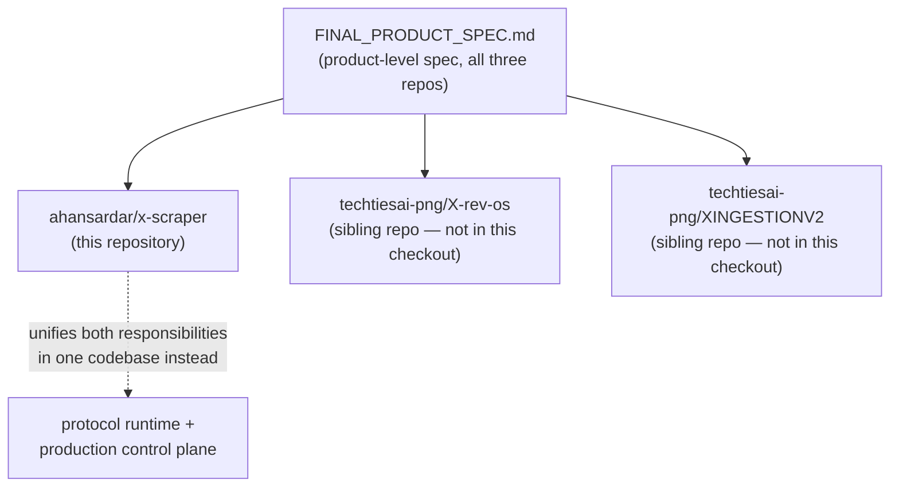

This document describes **only** `ahansardar/x-scraper`. The other two repositories are separate codebases under a different account, not present in this working tree, and are out of scope here — any external review of "XINGESTIONV2" or "X-rev-os" source files is reviewing a different implementation of the same product spec, not this one. Nothing in this document should be read as a claim about those repositories.

**Spec trace:** §2 Why the Product Is Split into Two Active Repositories, §3 Historical Role of `x-scraper`.

---

## 3. System at a glance

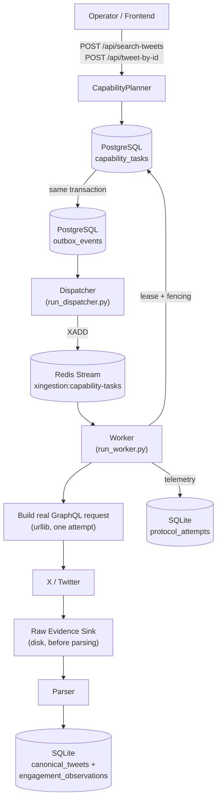

Three storage systems, three distinct jobs, deliberately never overlapping:

| Store | Technology | Owns | Can it be lost? |
|---|---|---|---|
| Task ledger + outbox | PostgreSQL (`postgres_sql/001_task_ledger_baseline.sql`) | Durable truth about work state | No — sole durable authority |
| Delivery queue | Redis Streams | "Who should pick this up next" | Yes — reconstructable from Postgres |
| Everything else | SQLite (`data/tasks.sqlite3`) | Canonical tweets, telemetry, sessions, releases, validation records | Operational state, not transactional-outbox-grade |

**Spec trace:** §4 Final Whole-System Architecture, §7.1–7.3 Production Control Plane.

---

## 4. The task lifecycle, end to end

### 4.1 A capability request becomes a durable task

`CapabilityRequest` (`src/xingestion/capabilities/models.py:51-71`) carries `capability_id`, `contract_version`, and a typed payload (`SearchTweetsInput` or `TweetByIdInput`, lines 15–45), each with its own `validate()`. `SearchTweetsInput.validate()` (lines 25–33) enforces non-empty query, `1 ≤ page_size ≤ 50`, `1 ≤ max_pages ≤ 25`. `TweetByIdInput.validate()` (lines 40–45) enforces a non-empty, numeric `tweet_id`.

`CapabilityPlanner.plan()` (`models.py:135-169`) turns a validated request into an `AcquisitionPlan` — binding it to a specific recipe revision inside the currently-eligible `ProtocolReleaseManifest` (statuses `CANDIDATE`/`APPROVED` by default, line 130–133). Critically, the plan is capability-contract-clean: it carries `release_id`, `recipe_revision_id`, `required_auth_class`, cursor/page fields — **no GraphQL operation IDs, no headers, no cookies** (`AcquisitionPlan`, lines 89–115).

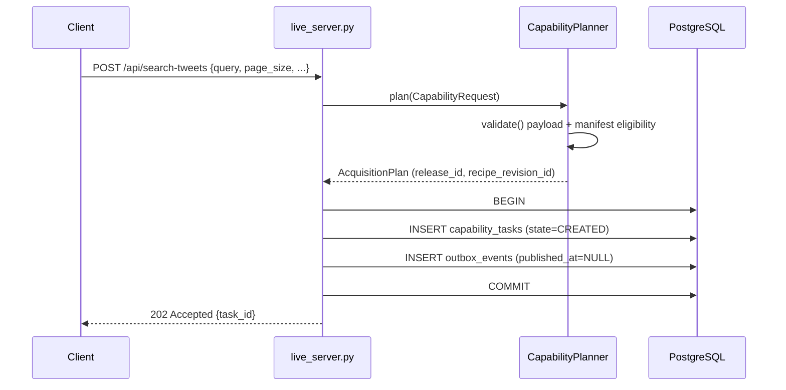

The task and its outbox row are written in **one transaction** (`postgres_ledger.py:41-97`) — the classic transactional-outbox pattern, closing the gap where a task could be created but never dispatched if the process died between the two writes. Idempotency is enforced by a `UNIQUE` constraint on `idempotency_key`; a duplicate submission returns the existing task rather than creating a second one (`postgres_ledger.py:98-107`).

**Spec trace:** §5 Stable Product Capabilities, §6 Capability Planner, §7.2 Transactional Outbox.

### 4.2 Task states

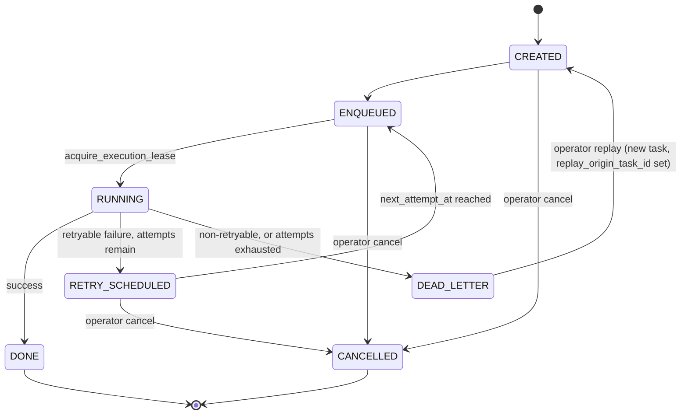

Exact enum, `src/xingestion/tasks/ledger.py:10-17`: `CREATED, ENQUEUED, RUNNING, RETRY_SCHEDULED, DONE, DEAD_LETTER, CANCELLED` — this is a verbatim match to the spec's own state list (§7.1, lines 317–324), including the two states (`CANCELLED`, and dead-letter replay) the spec text doesn't enumerate but that the implementation adds for operator control. Every transition is a compare-and-swap `UPDATE ... WHERE task_id=%s AND state=%s` (`postgres_ledger.py:698-711`); a zero-row update raises `ValueError` rather than silently no-op'ing (line 729).

Terminal-state retention (`apply_retention`, `postgres_ledger.py:235-283`) only ever deletes `DONE`/`CANCELLED` rows older than a cutoff — `DEAD_LETTER` rows are never auto-deleted regardless of age, so a failure is never garbage-collected out from under an operator.

**Spec trace:** §7.1 PostgreSQL as durable authority, §9 Dead-Letter and Replay.

### 4.3 Outbox → Redis: the dispatcher

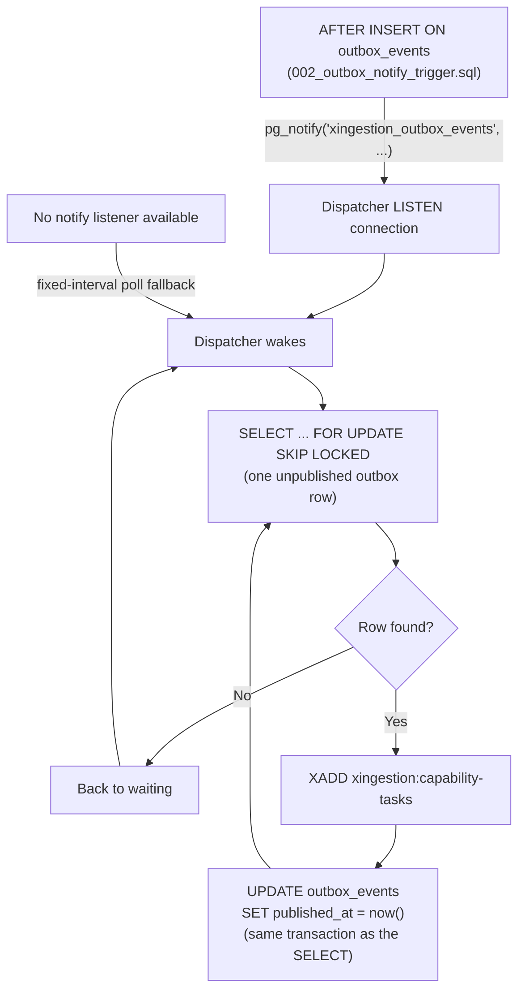

`PostgresOutboxNotificationListener` (`src/xingestion/dispatch/redis_dispatcher.py:50-101`) issues a real `LISTEN xingestion_outbox_events` and blocks on `conn.notifies(...)`; the Postgres-side trigger (`002_outbox_notify_trigger.sql`) fires `pg_notify` on every outbox insert, computing a `wake_latency_ms` the listener surfaces back (lines 82–90). `RedisOutboxDispatcher.dispatch_once()` (`redis_dispatcher.py:126-164`) does the claim-and-publish in one Postgres transaction: `XADD` happens *before* the row is marked `published_at` (lines 143–159) — deliberately, so a crash between the two produces a harmless duplicate `XADD` on the next pass rather than a silently lost task (comment at lines 106–113 states this explicitly). This is "at-least-once," never "at-most-once," by design.

**Spec trace:** §7.2 Transactional outbox, §7.3 Redis Streams ("It is not the authoritative task database").

### 4.4 Worker claim, execution, and fencing

```mermaid
sequenceDiagram
    participant Worker
    participant Redis
    participant PG as PostgreSQL

    Worker->>PG: enqueue_due_retries() + recover_expired_leases()
    Worker->>Redis: XAUTOCLAIM (steal stale pending entries first)
    alt stale entry reclaimed
        Redis-->>Worker: old, unacked message
    else nothing stale
        Worker->>Redis: XREADGROUP (new message)
        Redis-->>Worker: {task_id}
    end
    Worker->>PG: acquire_execution_lease(task_id)
    Note over PG: fenced: only succeeds if ENQUEUED and unleased;<br/>bumps delivery_generation, attempt_count
    PG-->>Worker: RUNNING, lease_token issued
    Worker->>Worker: build request -> call X -> parse
    Worker->>PG: transition RUNNING -> DONE<br/>(fenced by lease_token + delivery_generation)
    Worker->>Redis: XACK
```

`LocalWorker._process_delivery()` (`src/xingestion/workers/local_worker.py:112-465`) is the full execution path. Reclaim uses `XAUTOCLAIM` (`_reclaim_stale_delivery`, lines 497–513) — not manual `XPENDING`+`XCLAIM` — against `min_idle_time=redis_claim_min_idle_ms` (default 300000ms). **Fencing** means every write to a `RUNNING` task must present the exact `lease_token` and `delivery_generation` it was issued (`acquire_execution_lease`, `postgres_ledger.py:507-545`); a write presenting a stale pair is rejected with `ValueError`, and the worker treats that as "someone else already resolved this" rather than crashing (`local_worker.py:318-331, 434-447` — this exact code path is covered by a regression test, `test_worker_survives_lease_stolen_during_failure_handling`, `tests/test_local_worker.py:1344-1408`, added after this rejection was previously an unhandled crash).

The Redis message is **always** `XACK`'d once `_process_delivery` returns, in a `finally` block (`local_worker.py:99-110`) — Redis ack timing is not the correctness guard; Postgres fencing is.

### 4.5 Crash recovery

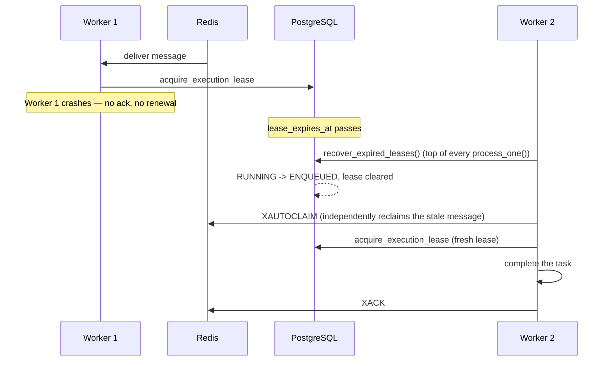

Two independently-sufficient safety nets — Postgres lease-expiry and Redis `XAUTOCLAIM` — catch a crashed worker; either alone recovers the task, so a bug in one doesn't leave work stuck. This is not just claimed: `tests/test_delivery_load.py` (gated by `XINGESTION_RUN_LOAD_TESTS=1`, run in CI's `test-postgres-redis` job) drives 150 concurrent deliveries across 4 real workers with zero loss (lines 178–193), simulates 3 crashed consumers with 30 stuck deliveries reclaimed by 2 recovering workers (195–221), and runs 20 dispatch/process cycles asserting no backlog accumulates (223–240).

**Spec trace:** §7.4 Worker Leases, §7.5 Fencing.

### 4.6 Redis/Postgres divergence

`reconcile_redis_stream_backlog` (`src/xingestion/dispatch/redis_stream_stats.py:13-61`) `XRANGE`s the stream, cross-references every `task_id` against the Postgres ledger, and `XDEL`s entries whose task no longer exists (e.g. deleted by retention while still undelivered) — dry-run by default, invoked via `run_outbox.py --reconcile-stream [--apply]`. The mirror-image case — an outbox row pointing at a deleted task — is structurally impossible: `outbox_events.task_id` has a Postgres foreign key with no cascade (`001_task_ledger_baseline.sql:37`), so the database itself refuses that delete.

**Spec trace:** §7.3 Redis Streams ("reconstructable, never authoritative").

---

## 5. Protocol runtime and recipe composition

### 5.1 What a "recipe" actually is

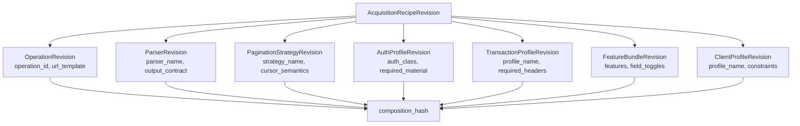

Every class the spec names in §11 (`ProtocolCapabilityBinding`, `AcquisitionRecipeRevision`, `OperationRevision`, `ParserRevision`, `PaginationStrategyRevision`, `AuthProfileRevision`, `TransactionProfileRevision`, `FeatureBundleRevision`) exists verbatim in `src/xingestion/xprotocol/protocol/models.py:53-229`, plus one more the spec doesn't explicitly enumerate (`ClientProfileRevision`, lines 159–173). `composition_hash` is the recipe's own `content_hash`, itself computed from every child revision's `content_hash` (`Revision.__post_init__`) — changing *any one piece*, even just the parser, produces a new composition hash, making "has this exact combination been validated" a precise, checkable question rather than a vague one.

Two recipes are pinned today in the sole release manifest, `protocol_releases/search_tweets.candidate.json` (`release_id = "xrev-search-tweets-2026-08-10-candidate-1"`): `SEARCH_TWEETS` (`operation_id = "PusO6nN_nUSAsfJktZJd9w"`, GraphQL operation `SearchTimeline`) and `TWEET_BY_ID` (`operation_id = "GZsN2Pc4knAoit6pXa4HSA"`, operation `TweetResultByRestId`), both real, browser-captured operation IDs — not placeholders.

### 5.2 One attempt, typed result

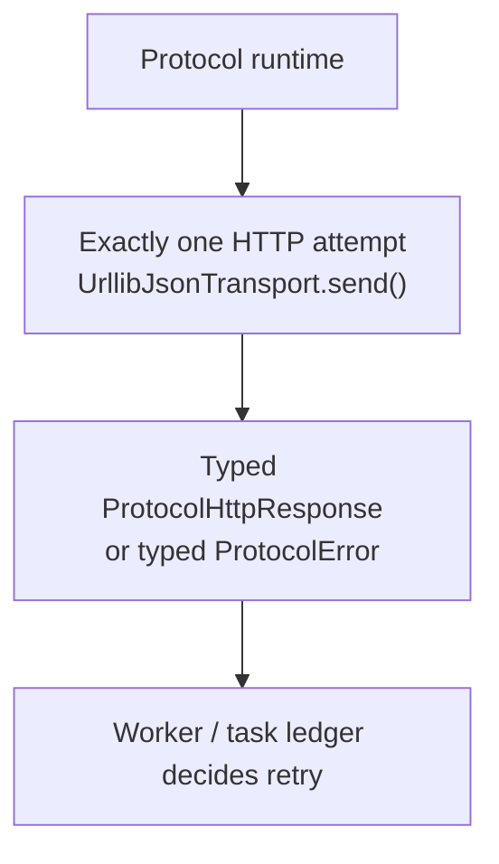

`OneAttemptTransport` (`src/xingestion/xprotocol/runtime/transport.py:42-44`) is a `Protocol` interface with exactly one method, `.send()`. Its concrete implementation, `UrllibJsonTransport` (`urllib_transport.py:16-50`), uses Python's **standard-library `urllib`** — confirmed by direct grep across `src/` and `tests/`: **zero matches for `twikit` or `playwright`, case-insensitive, anywhere in either tree.** There is no scraping-library dependency and no browser automation anywhere in this repository's acquisition path.

`response_to_protocol_error()` (`transport.py:47-98`) maps every non-2xx HTTP outcome to a typed `ProtocolError` up front, at the transport boundary:

| HTTP status | `error_class` | `retry_disposition` |
|---|---|---|
| 401 / 403 | `AUTH_OR_SESSION_REJECTED` | `NEVER` |
| 404 | `OPERATION_NOT_FOUND` | `NEVER` |
| 429 | `RATE_LIMITED` | `RETRY_AFTER` (reads `retry-after` header) |
| 5xx | `UPSTREAM_SERVER_ERROR` | `MAY_RETRY` |
| other non-2xx | `UNEXPECTED_HTTP_STATUS` | `MAY_RETRY` |

No retry ever happens inside this layer — `RetryDisposition` is a classification the caller (the worker, §4.4) acts on, never a loop the transport runs itself. Also confirmed by grep: **zero matches for `x-client-transaction-id` or `client_transaction`** anywhere under `src/` — this system has no dependency on browser-derived transaction-metadata headers, because it never adopted the session-replay acquisition class that requires them.

**Spec trace:** §8 Retry Ownership ("The X-rev production runtime performs zero automatic retries"), §21 Typed Protocol Errors.

### 5.3 Evidence before normalization

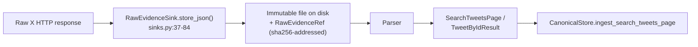

Traced directly in source order: in `search_tweets.py:acquire_search_tweets_page`, `raw_evidence_sink.store_json(...)` executes at lines 69–83, and `parse_search_tweets_page(...)` — the normalization step — runs immediately after at lines 84–87. The identical order holds in `tweet_by_id.py:acquire_tweet_by_id` (store at 46–57, parse at 58). `FileRawEvidenceSink.store_json()` (`evidence/sinks.py:37-84`) writes two files per call — the exact raw payload bytes and a metadata sidecar carrying a SHA-256 content hash, an `evidence_id`, and a timestamp — with no update/delete path: each capture is immutable once written. If a parser bug is later found, the fix is "reprocess the stored evidence," not "ask X again."

**Spec trace:** §16 Raw Evidence, §17 Why Raw Evidence Must Be Stored Before Normalization (spec's own justification matches this implementation's ordering exactly).

### 5.4 Proof the recipe model generalizes: adding a second capability

`TWEET_BY_ID` was added specifically to test whether the architecture generalizes past `SEARCH_TWEETS`, not just describes it:

| Layer | Reused as-is | Built new for `TWEET_BY_ID` |
|---|---|---|
| Tweet-field extraction | `tweet_fields.py` (`TweetRecord`, `make_tweet_record`) | — |
| Worker lifecycle | `_process_delivery()` in full: leasing, retries, telemetry, dead-lettering | one new branch in `_execute_task()` (`local_worker.py:642-649`) |
| Canonical storage | `ingest_search_tweets_page()` directly | the single result is wrapped as a one-tweet `SearchTweetsPage(next_cursor=None)` (lines 651–658) so nothing downstream needs a capability-specific branch |
| Recipe shape | The same 7-part `AcquisitionRecipeRevision` | its own `operation` (`TweetResultByRestId`, not `SearchTimeline`), `parser`, and a degenerate `single_page` pagination revision |
| Fixture/promotion validation | Nothing — deliberately not reused | own fixtures (`tests/fixtures/tweet_by_id/`); real fixture/capture-replay promotion validation is still pending (see §14) |

The practical result: adding capability #3 should mean writing one `operation`/`parser` pair and a manifest binding — not touching the worker or canonical store again.

**Spec trace:** §5 Stable Product Capabilities (multi-capability extensibility), §11 X-rev-os Protocol Model.

---

## 6. Session, credential, and network model

### 6.1 Session health

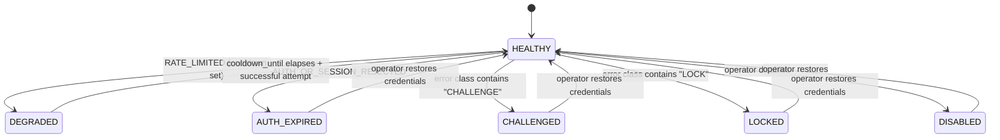

`SessionHealth` (`src/xingestion/sessions/store.py:14-21`): `HEALTHY, DEGRADED, AUTH_EXPIRED, CHALLENGED, LOCKED, DISABLED, UNKNOWN` — a **verbatim match** to the spec's §10.4 list. Health transitions on protocol failure are driven automatically by the worker (`_session_health_for_protocol_error`, `local_worker.py:732-743`): `AUTH_OR_SESSION_REJECTED → AUTH_EXPIRED`, `RATE_LIMITED → DEGRADED` with a cooldown, any error class containing `"CHALLENGE"` → `CHALLENGED`, containing `"LOCK"` → `LOCKED`. Recovery out of `AUTH_EXPIRED`/`CHALLENGED`/`LOCKED` requires an **operator** action — there is no automated path back into those states, because there is no automated re-authentication at all (see §6.2).

### 6.2 Credential hygiene — enforced, not just documented

`SessionStore.upsert_session()` rejects raw secret material outright:

```python
# src/xingestion/sessions/store.py:66-67
if credential_ref.startswith(("auth_token=", "ct0=", "Bearer ")):
    raise ValueError("credential_ref must be a secret reference, not raw secret material")
```

`SessionRecord` (lines 25–43) stores only `credential_ref` — an opaque pointer resolved separately by `secrets.py`'s `EnvSecretProvider`/`FileSecretProvider` (`src/xingestion/secrets.py:32-90`), which convert a reference into ephemeral, in-memory `WebSessionAuth` material only at the point of an actual request, never persisted. This is enforced beyond code review: **`tests/test_secret_hygiene.py` greps every `git ls-files`-tracked file in the repository** for raw auth patterns (`auth_token=...`, `ct0=...`, `Bearer ...`, and the corresponding env-var names) and fails the build if any are found outside a small documentation allowlist.

There is also no automated login path to audit: a repo-wide, case-insensitive grep under `src/` for `login(`, `password`, and `TOTP` returns **zero matches for all three**. Session recovery from a degraded state is not "try logging back in" — it doesn't exist as a code path — it is exclusively an operator action (`errors.py:81`, `operator_action="restore_or_replace_x_session_credentials"`).

### 6.3 Leasing and rate-limit cooldown

`acquire_session()` (`sessions/store.py:117-180`) runs inside a `BEGIN IMMEDIATE` transaction, selecting a session that is `HEALTHY`, or `DEGRADED` with an elapsed `cooldown_until`, with no live lease, ordered oldest-updated-first — then issues a fresh `lease_token`. `release_session()` (182–197) only clears a lease if the caller presents the exact matching token, preventing one owner from releasing another's lease. Cooldown (added by migration `004_session_cooldowns.sql`) is the rate-limit backoff mechanism: a `DEGRADED` session with a future `cooldown_until` is invisible to `acquire_session` until that time passes.

### 6.4 Network policy

`NetworkPolicy` (`sessions/network.py:9-31`) models a labeled route — `kind ∈ {direct, proxy, vpn}`, plus optional `route`/`region` — matched hierarchically by `network_matches()`. This is route-*labeling* for worker/session filtering, not literal IP-affinity enforcement; the spec's fuller `NetworkContext` vision (region, transport metadata, managed proxy/VPN provisioning) is a known, tracked gap (see §14, R-04-equivalent).

**Spec trace:** §10 Account, Credential, Session, and Network Model (10.1–10.6), §31 Security Model.

---

## 7. Error taxonomy and retry ownership

The complete `ERROR_PROFILES` table, `src/xingestion/errors.py:76-161` — every entry that exists, verbatim:

| error_class | severity | scope | operator_action | retryable |
|---|---|---|---|---|
| `AUTH_OR_SESSION_REJECTED` | HIGH | SESSION | restore_or_replace_x_session_credentials | **False** |
| `RATE_LIMITED` | MEDIUM | SESSION | wait_for_cooldown_or_rotate_healthy_session | True |
| `OPERATION_NOT_FOUND` | CRITICAL | PROTOCOL | investigate_protocol_release_and_consider_quarantine | False |
| `PROTOCOL_RELEASE_BLOCKED` | HIGH | RELEASE | activate_release_after_investigation_or_publish_new_release | False |
| `SESSION_UNAVAILABLE` | HIGH | SESSION | restore_or_add_a_healthy_session | True |
| `UPSTREAM_SERVER_ERROR` | MEDIUM | TRANSPORT | monitor_retries_and_check_x_availability | True |
| `TRANSPORT_ERROR` | MEDIUM | TRANSPORT | check_network_dns_tls_and_proxy_path | True |
| `UNEXPECTED_HTTP_STATUS` | MEDIUM | TRANSPORT | inspect_raw_evidence_and_protocol_response | True |
| `TASK_NOT_FOUND` | HIGH | STORAGE | inspect_sqlite_task_ledger_integrity | False |
| `OBJECT_NOT_FOUND` | LOW | PROTOCOL | no_action_object_does_not_exist_or_was_deleted | False |
| `ACCESS_NOT_AUTHORIZED` | LOW | PROTOCOL | no_action_object_is_protected_or_access_restricted | False |
| `ValueError` (fallback) | HIGH | TASK | inspect_task_payload_and_planner_contract | False |

The load-bearing line for retry-storm safety: **`AUTH_OR_SESSION_REJECTED` is `retryable=False`.** An authentication failure never triggers an automatic retry — it dead-letters the task and forces an operator to restore credentials. There is no path in this codebase from "session rejected" to "keep hammering the session."

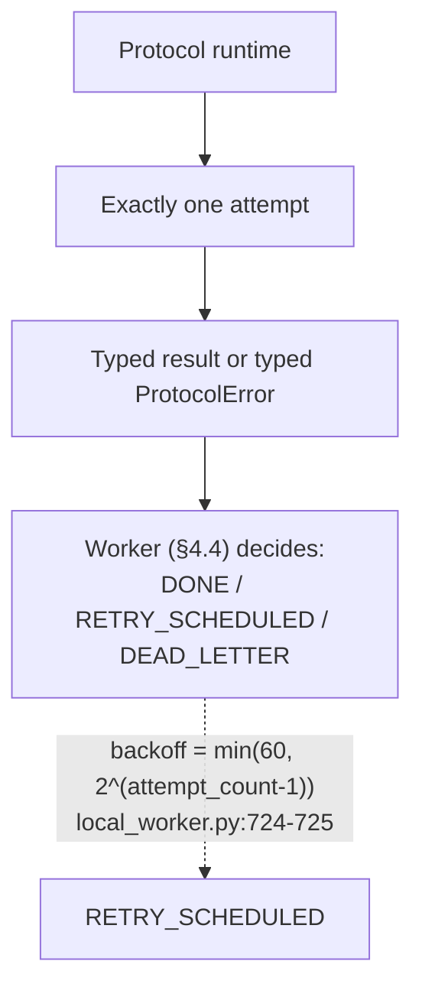

Retry scheduling lives entirely in the worker/ledger layer (`_handle_failure`, `local_worker.py:680-721`), driven by `retry_disposition` from the error, with a capped exponential backoff — the protocol layer never decides to retry itself, matching the spec's "5 production attempts ≠ 15 real X requests" concern (§8) directly, because the multiplier that concern describes (hidden retries inside the protocol layer) does not exist here.

**Spec trace:** §8 Retry Ownership, §21 Typed Protocol Errors, §22 Failure Isolation.

---

## 8. Canonical data and release governance

### 8.1 Canonical schema

Confirmed exhaustively — exactly two tables exist, nothing more (`src/xingestion/canonical/store.py`):

| Table | Fields | Update strategy |
|---|---|---|
| `canonical_tweets` | `tweet_id` (PK), `username`, `name`, `text`, `source_created_at`, `first_seen_at`, `last_seen_at`, `canonical_url`, `media_json` | One row per tweet; `ON CONFLICT ... DO UPDATE` refreshes everything **except** `first_seen_at`, which is set once on first insert and never overwritten (lines 70–77) |
| `engagement_observations` | `observation_id` (PK), `tweet_id`, `task_id`, `captured_at`, `reply_count`, `repost_count`, `like_count`, `quote_count`, `bookmark_count`, `view_count` | A **new row every observation**, never updated — engagement counts are a time series, not a mutable field |

Time semantics implemented — `source_created_at`, `first_seen_at`, `last_seen_at`, `captured_at` — all four exist exactly as spelled in the spec. Not yet implemented: `source_updated_at`, `normalized_at`, and canonical entities beyond tweets/engagement (`User`, `List`, `Community`, `RelationshipEdge`) — tracked in §14.

### 8.2 Release health and the promotion safety gate

`ReleaseHealth` (`src/xingestion/releases/store.py:11-17`): `UNKNOWN, ACTIVE, DEGRADED, STALE, QUARANTINED, RETIRED`. Execution is blocked only when health is `QUARANTINED` or `RETIRED` (`execution_allowed`, line 93–95) — this is the one place a non-blocking observability signal becomes a hard gate.

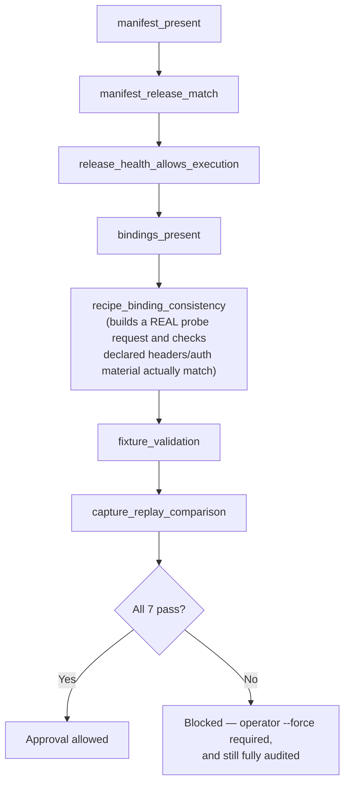

`build_promotion_safety_report()` (`releases/promotion.py:119-258`) runs all seven checks in this order before any release can be approved. Every check/approve run writes a redacted `RELEASE_PROMOTION_AUDIT` JSON to disk — release ID, manifest path, before/after approval state, full safety report, whether it was forced, operator's stated reason — with no raw secrets and no raw evidence bodies (`write_promotion_audit`, lines 261–332). Path-traversal into that audit trail is explicitly tested and rejected (`test_release_promotion.py`).

### 8.3 Three separate trust signals

The system deliberately tracks three different questions about recipe trustworthiness, because none of them can answer the other two:

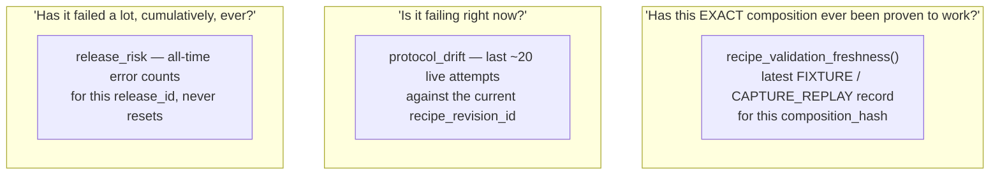

All three are exposed as **non-blocking warnings** in health reports, `/api/metrics`, and `run_supervisor_check.py` — only a full `QUARANTINED`/`RETIRED` release-health flag blocks execution; the rest are operator signals, not automatic circuit breakers.

**Spec trace:** §14 Three Separate State Dimensions, §23–27 Protocol Validation / Validation Lifecycle / Release Model / Promotion Lifecycle / Drift Detection.

---

## 9. Observability, operator console, and migrations

### 9.1 Telemetry

`ProtocolTelemetryStore` (`src/xingestion/telemetry/store.py`) records one row per attempt (`protocol_attempts` table: `task_id`, `capability_id`, `release_id`, `recipe_revision_id`, `state`, `session_id`, `network_context`, `error_class`, `tweet_count`, `duration_ms`, `created_at`) and exposes summary/network/drift aggregations consumed by `health_report.py`'s higher-level synthesis (release risk, network route recommendations, protocol drift).

### 9.2 Web/API layer — and an honestly-disclosed gap

`live_server.py` is a raw stdlib `http.server` application (no framework), exposing ~40 routes under `/api/*` (task submission, session/release/telemetry inspection, replay/cancel/reprocess/investigate, support exports, release approval) plus a 3-file static frontend (`index.html`, `styles.css`, `app.js`).

**This is explicitly an internal operator console, not the spec's external northbound API (§30), and it currently has no authentication.** `_require_admin()` (`live_server.py:932-933`) is an unconditional `return True`; `_storage_dict()` reports `"operator_auth_required": False` (line 1094). This is not accidental drift — three tests (`test_northbound_api.py:270-296`) pin this as *current, intentional* behavior for a local single-operator deployment, not a bug. It is, however, a real gap against a production/multi-tenant deployment and is listed as such in §14 rather than glossed over here.

### 9.3 Migrations

Two independent, hand-rolled runners (no Alembic/ORM): `MigrationRunner` for SQLite (8 migrations, `sql/001` through `sql/008`) and `PostgresMigrationRunner` for the task ledger (2 migrations, `postgres_sql/001`–`002`). Both are idempotent (`CREATE TABLE IF NOT EXISTS`, tolerated duplicate-column errors) and version-pinned by tests (`EXPECTED_MIGRATIONS` in `test_migrations.py` and `test_postgres_migration_runner.py`) — a prior incident where this pin went stale after a merge was caught and fixed (commit `312c338`).

**Spec trace:** §28 Monitoring (not started, see §14), §30 Northbound API (not started, see §14), §33 Observability.

---

## 10. Testing and CI evidence

37 test modules under `tests/`, organized roughly 1:1 with the subsystems above (`test_postgres_task_ledger.py`, `test_local_worker.py`, `test_redis_stream_stats.py`, `test_delivery_load.py`, `test_session_store.py`, `test_secret_hygiene.py`, `test_errors.py`, `test_canonical_store.py`, `test_release_promotion.py`, `test_northbound_api.py`, `test_migrations.py`, and more).

CI (`.github/workflows/ci.yml`) runs two jobs on every push/PR to `main`:

| Job | Platform | Python | What it proves |
|---|---|---|---|
| `test` | `windows-latest` | 3.11, 3.12 | Full suite discovery, source/script compilation, protocol fixture validation, and a static grep-based smoke test that the frontend actually exposes every operator affordance it claims to (release governance, sessions, support exports, outbox recovery, ...) |
| `test-postgres-redis` | `ubuntu-latest` + real `postgres:16-alpine` and `redis:7-alpine` service containers | 3.11, 3.12 | The 11 tests that require a live database/queue, including the load/crash-recovery suite (`test_delivery_load.py`, opt-in via `XINGESTION_RUN_LOAD_TESTS=1`) |

This is the CI evidence behind the crash-recovery and fencing claims in §4.5 — they are exercised against real Postgres and Redis service containers, not mocks.

---

## 11. Direct answers to the questions an architecture review would ask

This section exists so a reviewer doesn't have to re-derive these answers from the rest of the document — each row states the concern, the verified answer, and where to check it.

| Review question | Verified answer | Evidence |
|---|---|---|
| Is there a scraping-library or browser-automation dependency in the acquisition path? | No. Grep confirms zero matches for `twikit` or `playwright` anywhere under `src/` or `tests/`. Acquisition is direct GraphQL over stdlib `urllib`. | §5.2; `urllib_transport.py:16-50` |
| Can raw session secrets end up in a durable task or session record? | No — rejected at the API boundary. `upsert_session` raises on any string starting with `auth_token=`, `ct0=`, or `Bearer `, and repo-wide secret patterns are grepped in CI via `test_secret_hygiene.py`. | §6.2; `sessions/store.py:66-67` |
| Are authentication failures retried automatically, risking retry storms? | No. `AUTH_OR_SESSION_REJECTED` is `retryable=False` in the error taxonomy; recovery requires an explicit operator action, not automated re-login (no `login(`/`password`/`TOTP` code exists in `src/` at all). | §6.2, §7; `errors.py:77-83` |
| Can a failure path fabricate synthetic tweet IDs or invented data? | No such path exists. There is no "recovery" or degraded-fidelity acquisition mode in this codebase — a request either produces a real, parsed `TweetRecord` from a real X response, or a typed `ProtocolError`. Nothing sits between those two outcomes. | §5.2, §5.3 |
| Is there a hidden dependency on browser-derived transaction metadata (e.g. `x-client-transaction-id`)? | No. Zero matches anywhere under `src/` for `x-client-transaction-id` or `client_transaction`. The pinned header set is exactly `authorization`, `x-csrf-token`, `x-twitter-active-user`, `x-twitter-auth-type`, `x-twitter-client-language`, `cookie`, `referer`. | §5.2; `protocol_releases/search_tweets.candidate.json:59-65` |
| Is raw evidence persisted before or after normalization? | Before, in both capability code paths, confirmed by source-order tracing (`store_json()` precedes `parse_*()` in both `search_tweets.py` and `tweet_by_id.py`). | §5.3 |
| Does the protocol/runtime layer perform its own retries, hiding real request volume from the control plane? | No — confirmed at the transport level: `OneAttemptTransport` has exactly one method, `.send()`, called exactly once per acquisition call; all retry *scheduling* happens one layer up, in the worker/ledger. | §5.2, §7 |
| Is there more than one competing implementation of "how to talk to X" in this codebase? | No — one `OneAttemptTransport` implementation (`UrllibJsonTransport`), one recipe model, one manifest resolution path (`resolve_approved_manifest`, singular by construction). Two capabilities share the same transport and recipe shape. | §5.1, §5.4 |
| Can a crashed worker cause a task to be silently lost or double-processed with conflicting results? | No — two independent recovery mechanisms (Postgres lease expiry, Redis `XAUTOCLAIM`) plus write-level fencing by `lease_token`+`delivery_generation` reject stale writes outright; exercised under real crash simulation in `test_delivery_load.py` against live Postgres/Redis in CI. | §4.4, §4.5, §10 |
| Is the operator-facing web surface authenticated? | **No — and this is a genuine, disclosed gap**, not a hidden one. `_require_admin()` is a no-op today; this is pinned as intentional for the current local, single-operator deployment model and is listed explicitly in §14 as unresolved against a production/multi-tenant posture. | §9.2; `live_server.py:932-933` |

---

## 12. Spec coverage matrix

| `FINAL_PRODUCT_SPEC.md` area | Status | Notes |
|---|---|---|
| Capability-driven API | Partial | Implemented for `SEARCH_TWEETS`; `TWEET_BY_ID` architecturally complete, unapproved |
| Capability planner | Implemented | For the two existing capabilities |
| Protocol runtime foundation | Implemented | Recipe model, one-attempt transport, typed errors |
| Approved protocol release manifest | Implemented | One manifest, `SEARCH_TWEETS` approved |
| Raw evidence before parsing | Implemented | Verified by source-order tracing, §5.3 |
| One-attempt runtime, zero hidden retries | Implemented | §5.2, §7 |
| Durable task lifecycle (Postgres) | Implemented | Single-node local Postgres, not managed/clustered/HA |
| Transactional outbox | Implemented | |
| Redis Streams delivery, consumer groups, fencing | Implemented | Load/crash-tested in CI |
| Session health, leases, cooldown | Implemented | Not yet a full `Account`/`CredentialRef` split — see §14 |
| Canonical tweet + engagement data | Implemented | Narrower than spec's full canonical model |
| Reprocessing from raw evidence | Implemented | |
| Release risk / quarantine / drift | Implemented, non-blocking | Only `QUARANTINED`/`RETIRED` hard-blocks execution |
| Release rollout/rollback automation | Partial | Manual health controls only, no automated canary |
| Support exports / investigation packages | Implemented | Redacted, path-traversal-tested |
| Frontend operator console | Implemented | For the current capability slice; unauthenticated (§9.2) |
| Deployment tooling (migrations, preflight, supervisor, CI) | Implemented | |
| Secret backend (KMS/Vault-grade) | Not implemented | Env/file references only |
| Broader canonical model (`User`, `List`, `Community`, `RelationshipEdge`) | Not implemented | |
| Monitoring subscriptions | Not implemented | Every acquisition today is one-shot, not standing |
| External, versioned northbound API | Not implemented | Today's `/api/*` is the operator console |
| Downstream analytics/alerts/briefs | Not implemented | |
| Sanitized-fixture automation pipeline | Not implemented | Fixtures are manually curated today |
| Scale/chaos/soak certification | Not implemented | Load-tested at 150 concurrent deliveries, not chaos-tested |

---

## 13. Open gap register

Sourced directly from `docs/TASKS.md` and `docs/CURRENT_STAGE.md`, plus the operator-console auth gap surfaced in §9.2 — restated here in one place rather than left scattered.

| ID | Gap | Spec ref | Severity |
|---|---|---|---|
| G-01 | Only 1 of 11 spec capabilities (`SEARCH_TWEETS`) is `APPROVED`; `TWEET_BY_ID` is built but unvalidated; 9 more are unstarted | §5 | High — scope, not correctness |
| G-02 | `protocol_validation.py`'s fixture/capture-replay pipeline is hardcoded to `SEARCH_TWEETS`, blocking `TWEET_BY_ID` (or any new capability) from reaching `APPROVED` | §23–24 | High |
| G-03 | Monitoring subscriptions (standing watches, gap detection, backfill) — zero implementation; every acquisition today is one-shot | §28 | High — new subsystem |
| G-04 | No genuinely external, versioned northbound API — today's `/api/*` is the trusted operator console | §30 | High — new subsystem |
| G-05 | Canonical model limited to tweets + engagement; no `User`/`List`/`Community`/`RelationshipEdge` | §19 | Medium |
| G-06 | No automated release canary/rollback lifecycle — health is a manual toggle | §26 | Medium |
| G-07 | Typed error taxonomy has 12 of the spec's ~24 listed classes | §21 | Medium |
| G-08 | No distinct `Account`/`CredentialRef` entity separate from `SessionArtifact` — `account_label` is a string field on the session row, not an independently queryable identity | §10.1–10.2 | Medium |
| G-09 | No automated sanitized-fixture pipeline (raw capture → sanitize → secret-scan → human verify) — fixtures are manually curated | §32 | Medium |
| G-10 | Operator console has no authentication (`_require_admin()` is a no-op) | §31 (implied) | Medium for local single-operator use; **high before any multi-tenant or externally-reachable deployment** |
| G-11 | Single-node local Postgres/Redis (Docker Compose) — no replication, no Sentinel/Cluster, no chaos/soak-at-scale certification | §37 Scale | Medium — deployment posture, not architecture |
| G-12 | Network policy is label-based route matching, not literal IP/proxy affinity enforcement or managed proxy provisioning | §10.6 | Low–Medium |

None of these are disguised as done anywhere else in this document — every "Implemented" claim in §12 is implemented *for the scope stated*, and the boundary of that scope is this table.

---

## 14. What this document does not claim

Restated plainly, so it can't be read as overclaiming by omission:

- This is **not** a managed, clustered, or highly-available deployment. It is single-node local Postgres and Redis via Docker Compose.
- Distributed worker crash-recovery is verified functionally (real Postgres/Redis service containers, real crash simulation, 150-delivery load test) — but not against real OS-level process kills, network partitions, or a sustained multi-hour soak at scale.
- The protocol validation lifecycle, the full capability catalog, the complete account/secret/network subsystem, a complete analytics/monitoring platform, and scale/chaos/soak certification are all **not yet built** — see §14 gap register.
- The operator console has no authentication today and should not be treated as safe for multi-tenant or public-network exposure without that gap being closed first.
- This document describes `ahansardar/x-scraper` only. It makes no claim about `X-rev-os` or `XINGESTIONV2`, which are separate codebases not present in this repository.

**The accurate one-line claim:** this is a production-oriented local vertical slice of the final X protocol ingestion platform, centered on `SEARCH_TWEETS`, with a durable Postgres-backed task ledger, Redis Streams delivery with fenced crash recovery, evidence-first acquisition with zero hidden retries, credential-hygiene enforcement backed by a CI test, and an honest, tracked list of what isn't built yet.
