# How x-scraper Actually Works

This document explains the system that is **actually built and running today** — not the aspirational full product described in `FINAL_PRODUCT_SPEC.md`, and not a chronological history like `docs/WORKLOG.md`. Read this if you want to understand, end to end, what happens when a task is submitted, how the pieces fit together, and what happens when something breaks.

Every diagram below reflects real code paths in this repository. Where the system is intentionally simpler than the final spec's vision, that's called out rather than glossed over.

If you're new to this repo, read this document top to bottom once. After that, use it as a reference — jump to the section you need.

---

## 1. What This System Does, in Plain Language

This is a service that fetches tweets from X (Twitter) on request, in a way that is:

- **Durable** — a request is a database row, not an in-memory job. If every process on the machine dies mid-request, the request is still there when things restart, and it resumes safely rather than either vanishing or running twice.
- **Honest about failure** — X's protocol changes without notice. When a request to X fails, the system records *exactly* what failed and why, keeps the raw response bytes, and never quietly pretends things are fine.
- **Separated by concern** — "how do I ask X for tweets" (the *protocol* layer) is kept apart from "how do I durably run a job and retry it" (the *production control plane*). One can change without breaking the other.

The capability implemented and live-approved today is `SEARCH_TWEETS`: given a search query, fetch matching tweets, with pagination across multiple pages if requested. A second capability, `TWEET_BY_ID` (fetch one tweet by its ID, no pagination), is built end to end — capability contract, request builder, parser, worker dispatch, canonical storage — but its recipe binding is `DRAFT`, not `APPROVED`: it has no live-captured GraphQL operation ID yet, only a placeholder, so it isn't live traffic-eligible. Everything below describes `SEARCH_TWEETS`'s live path; §3.7 covers what `TWEET_BY_ID` reuses versus what's genuinely new per capability.

---

## 2. The Big Picture

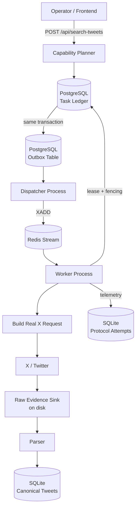

**Three separate storage systems, each with one job:**

| Store | Technology | Owns |
|---|---|---|
| Task ledger + outbox | PostgreSQL | Durable truth about what work exists and its state |
| Delivery queue | Redis Streams | Fast, reconstructable "who should pick this up next" — never authoritative |
| Everything else (sessions, releases, telemetry, canonical tweets, validation records) | SQLite | Operational state that doesn't need Postgres's concurrency guarantees |

Postgres is the only store you can't safely lose. Redis and SQLite can both, in principle, be rebuilt from Postgres and raw evidence.

---

## 3. From API Call to Stored Data — The Full Task Lifecycle

### 3.1 A capability request becomes a durable task

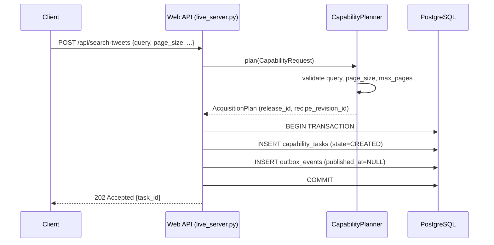

The insert into `capability_tasks` and the insert into `outbox_events` happen in **one transaction**. This is the "transactional outbox" pattern, and it exists to close one specific failure mode:

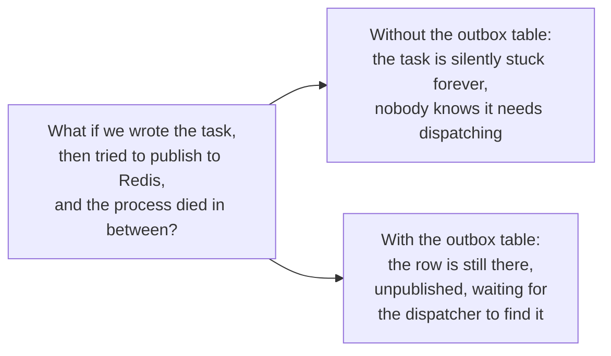

A task is only ever created once per **idempotency key** — submitting the same key twice returns the existing task rather than creating a duplicate.

### 3.2 The dispatcher moves work from Postgres to Redis

`run_dispatcher.py` wakes up two ways — a Postgres `LISTEN`/`NOTIFY` push (primary) and a fixed-interval poll (fallback), so a missing/unreachable notify listener never stalls dispatch, it just gets slower:

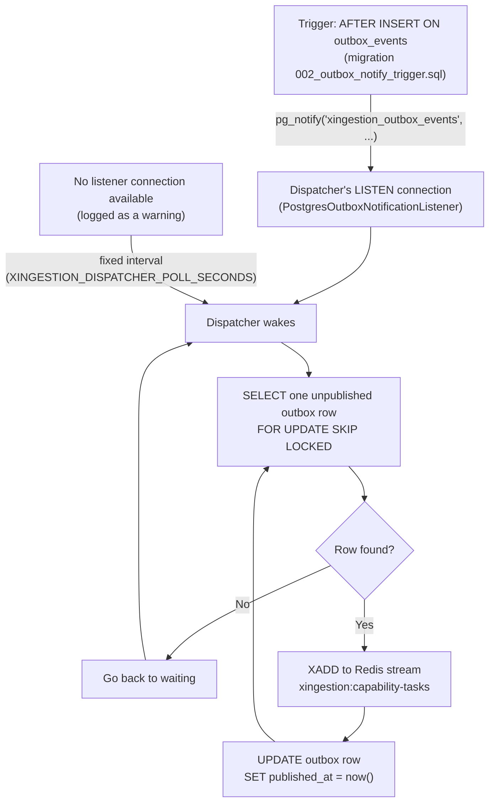

`FOR UPDATE SKIP LOCKED` means multiple dispatcher processes could safely run at once without double-publishing the same row — though today only one dispatcher process runs. On a wake, the dispatcher drains *every* currently pending row (not just one) before going back to waiting, so a single notification can flush an entire backlog.

The order of `XADD` then `UPDATE ... published_at` (not the reverse) is deliberate: if the dispatcher crashes between those two steps, the row is still unpublished, so the *next* dispatcher run re-publishes it. That produces a harmless duplicate Redis entry rather than a silently lost task — "at-least-once," never "at-most-once."

### 3.3 A worker claims and executes the task

`run_worker.py` runs a loop calling `LocalWorker.process_one()` roughly every 2 seconds:

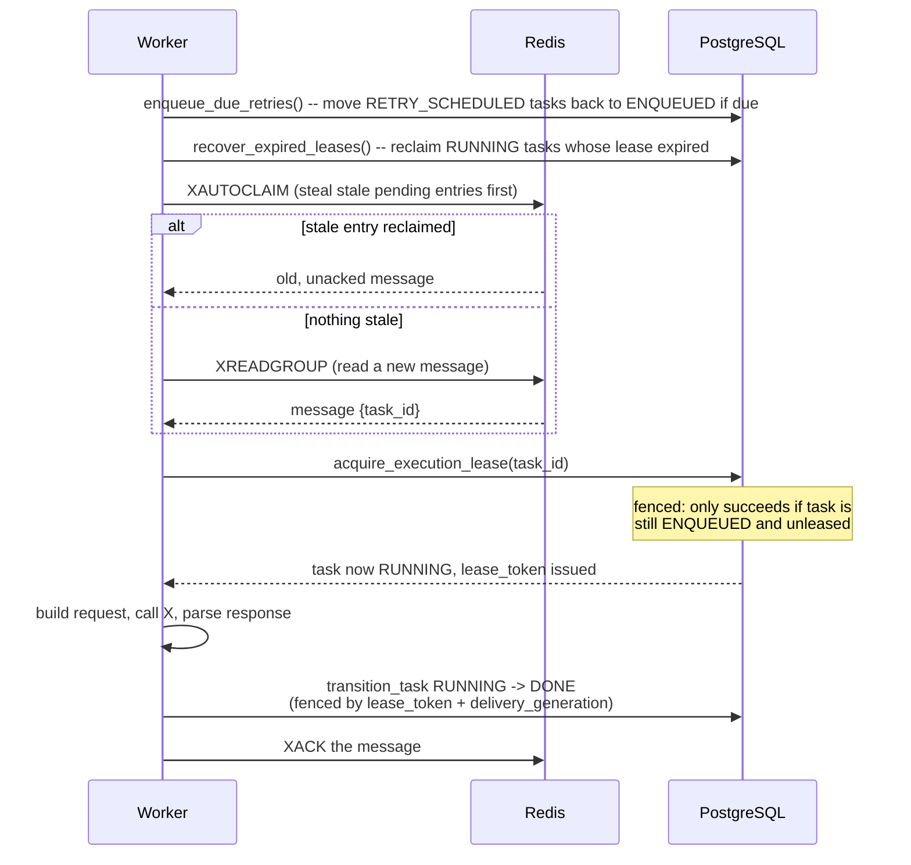

**Fencing** is the mechanism that makes this safe under crashes and races: every write to `capability_tasks` that changes a `RUNNING` task's state must present the exact `lease_token` and `delivery_generation` it was issued. If another delivery already claimed the task (a crash-recovery reclaim, for instance), that write is rejected — it's stale, and the ledger says so instead of silently overwriting newer state.

### 3.4 Building the real request to X

A "recipe" is the complete, versioned description of how to talk to X for one capability. It's composed of independent pieces, each independently versioned:

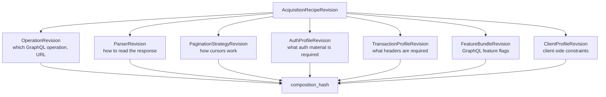

`composition_hash` is computed from every child piece's own content hash. Change *any* one piece — even just the parser — and the recipe gets a new composition hash. This is what makes "has this exact combination been validated" a precise, checkable question instead of a vague one (see §5).

`build_search_timeline_request()` takes the recipe plus real auth material and produces the actual HTTP request: GraphQL variables (`rawQuery`, `count`, `product`, `cursor`), headers (`authorization`, `x-csrf-token`, cookies, etc.), and the URL (built from the operation's `url_template` + `operation_id`).

### 3.5 Parsing and storing

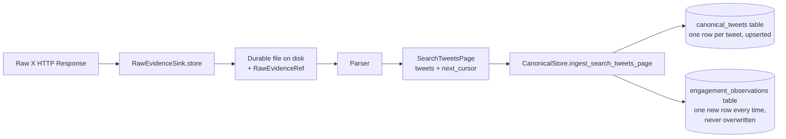

Two tables, two different update strategies, on purpose:

- **`canonical_tweets`**: one row per `tweet_id`. Re-fetching the same tweet *updates* its row (`ON CONFLICT ... DO UPDATE`) — text, username, etc. reflect the latest known state.
- **`engagement_observations`**: a new row is *inserted* every single time a tweet is seen, never updated. Like counts are a time series (`tweet_id=123, captured_at=T1, likes=100` then `tweet_id=123, captured_at=T2, likes=160`), not a single mutable number — consistent with the spec's explicit position that engagement counts are observations, not events.

The raw response is written to disk **before** parsing. If the parser has a bug, the raw bytes are still there — fix the parser, reprocess the existing evidence, no need to ask X again.

### 3.6 Pagination — multiple pages, one query

A multi-page search isn't one task that loops internally. It's a **chain of tasks**, one per page, each linked to the one before it:

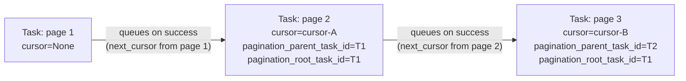

Before accepting a page's `next_cursor`, the worker checks it against **every cursor already used earlier in this exact chain** (walked backward via `pagination_parent_task_id`), not just the immediately previous page. If X returns a cursor that was already used two or three pages ago, that's a genuine cursor loop, and the task fails fast with `PAGINATION_CURSOR_LOOP` instead of paginating forever up to `max_pages`.

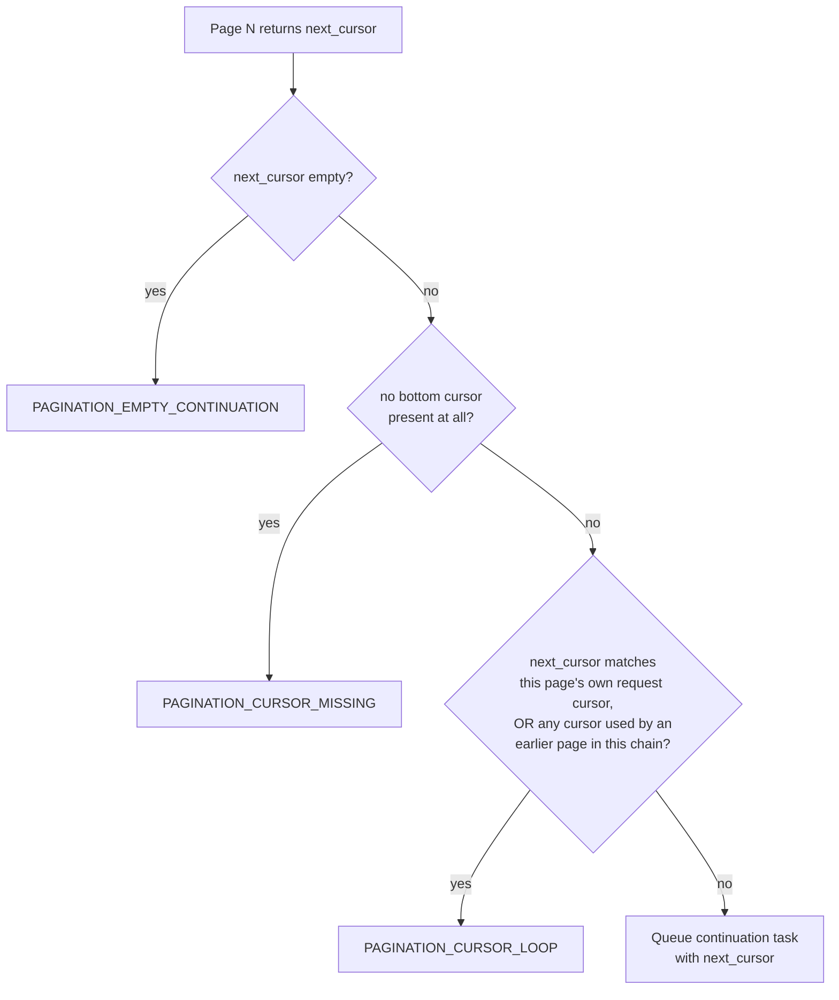

---

### 3.7 Adding a second capability — what's shared, what's new

`TWEET_BY_ID` was added as a second vertical slice to prove this architecture actually generalizes, not just describes `SEARCH_TWEETS`. It reuses almost everything except the parts that are genuinely protocol-specific:

| Layer | `TWEET_BY_ID` reuses as-is | `TWEET_BY_ID` needed its own |
|---|---|---|
| Tweet-field extraction | `xprotocol/runtime/tweet_fields.py` (`TweetRecord`, `make_tweet_record`, `merge_tweet_records`) — factored out of `search_tweets.py` for this reason | — |
| Worker lifecycle | `LocalWorker._process_delivery()` in full: lease fencing, session handling, retries, telemetry, dead-lettering | just a new branch in `LocalWorker._execute_task()` that calls `acquire_tweet_by_id()` |
| Canonical storage | `CanonicalStore.ingest_search_tweets_page()` directly | `_execute_task()` wraps the single `TweetRecord` result in a `SearchTweetsPage(tweets=(tweet,), next_cursor=None, ...)` so every downstream step (canonical ingest, pagination validation, continuation queueing, `result_json`) needs zero further changes |
| Auth / transaction / client profiles | Same `AUTHORIZED_WEB_SESSION` auth class and browser header set — genuinely the same values, copied into `TWEET_BY_ID`'s own recipe revision objects (the schema has no cross-binding sharing/pointer mechanism, so "reuse" means identical values, not a shared reference) | — |
| Recipe composition | `AcquisitionRecipeRevision`'s 7-part shape (`operation`, `parser`, `pagination`, `auth_profile`, `transaction_profile`, `feature_bundle`, `client_profile`) | its own `operation` (a different GraphQL query, `TweetResultByRestId`, not `SearchTimeline`), `parser`, and a **degenerate `pagination` revision** (`strategy_name: "single_page"`) since the schema requires every recipe to declare one, even for capabilities that never continue |
| Release manifest | The same `protocol_releases/search_tweets.candidate.json` file and release_id — the running system resolves exactly one *approved* release at a time (`ReleaseStore.approved_release_id()` is singular), so a second capability can only go live by joining the currently-approved release's `bindings` array, not by shipping in a separate release file | its own `ProtocolCapabilityBinding` entry within that array |
| Fixture/promotion validation | Nothing — this is the one place reuse would have been *wrong*. `protocol_validation.py` is hardcoded to `SEARCH_TWEETS`'s fixture directory and parser, so `record_recipe_validation_results()` needed a `capability_id` filter to stop recording `SEARCH_TWEETS`'s fixture-validation outcome against `TWEET_BY_ID`'s untested recipe too | its own fixture (`tests/fixtures/tweet_by_id/`) and unit-level parser tests; real fixture/capture-replay promotion validation for a second capability is still a `docs/TASKS.md` gap |

The practical upshot: adding capability #3 should mostly mean writing an `operation`/`parser` pair and a manifest binding, not touching the worker or canonical storage again.

---

## 4. What Happens When Things Go Wrong

### 4.1 A single attempt fails

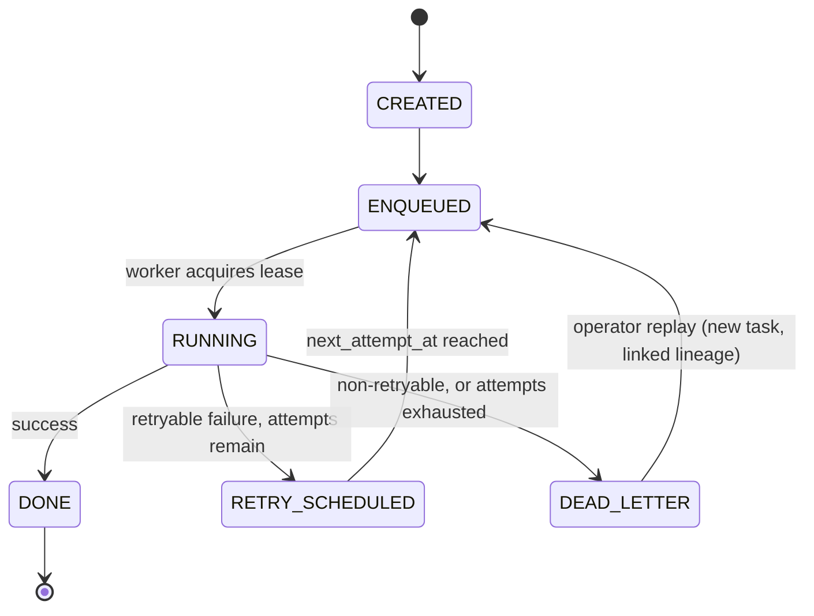

X never gets retried automatically by the protocol layer — every X call is a genuine "one attempt, typed result or typed error" (this is a deliberate spec principle: hidden retries at the protocol layer would make it impossible to reason about real request volume). All retry *scheduling* — how many attempts, how long to wait, backoff — is owned by the worker/ledger layer, driven by the failure's `retry_disposition` (`NEVER`, `MAY_RETRY`, `RETRY_AFTER`).

### 4.2 A worker crashes mid-task

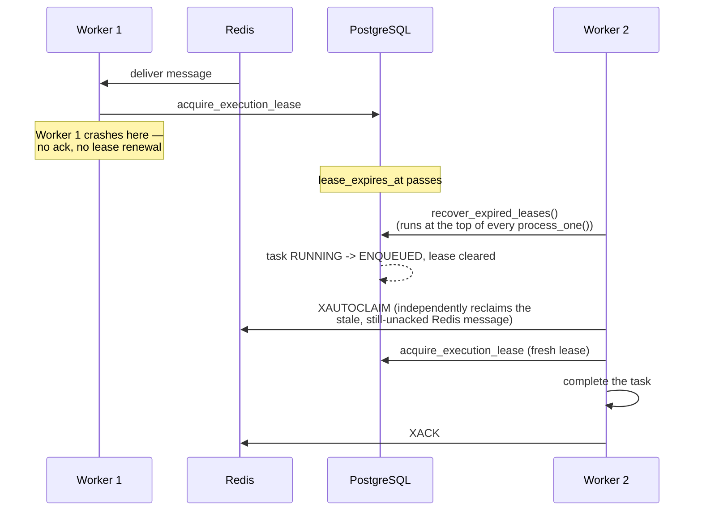

Two independent, deliberately uncoordinated safety nets catch this: Postgres's own lease-expiry check, and Redis's `XAUTOCLAIM` on stale pending entries. Either one alone is enough to recover; having both means a bug in one doesn't leave the system stuck.

There's a subtler race here too: what if the *original* worker wakes back up after being reclaimed and tries to write a result? Its lease token and delivery generation are now stale, so that write is rejected by the ledger's fencing (§3.3) — the correct, current owner's state wins. Earlier this session, that specific rejection was itself an unhandled exception that crashed the worker process; it's now caught and treated as "someone else already resolved this," matching how every other fencing loss in this codebase is handled.

### 4.3 The Redis stream and Postgres can disagree

Redis has no foreign-key relationship with Postgres — nothing stops a Redis stream entry from outliving the Postgres task it refers to. This is expected to happen occasionally in real operation: retention (`apply_retention()`) deletes old `DONE`/`CANCELLED` tasks, and if a stream entry for one of those tasks is still sitting undelivered behind a backlogged consumer group when that happens, it becomes an orphan — a message that can never be processed, because the task it points to is gone.

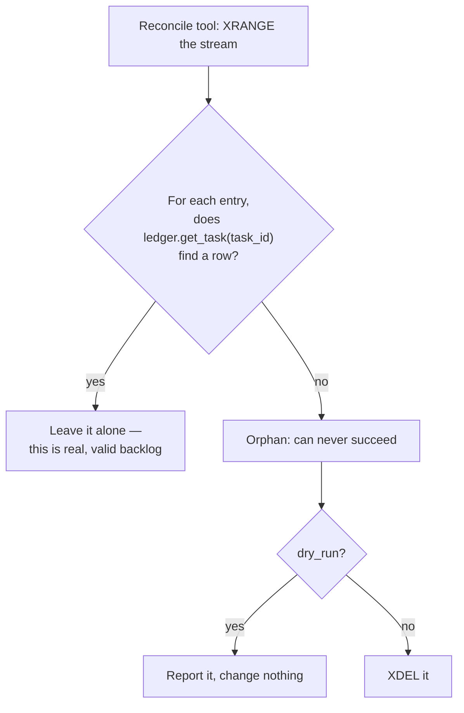

Run via `python run_outbox.py --reconcile-stream [--apply]` or `POST /api/outbox/reconcile-stream`. Dry-run by default. (An earlier design tried to solve the mirror-image problem on the Postgres side — an outbox row referencing a deleted task — but that's actually impossible: `outbox_events.task_id` has a foreign key back to `capability_tasks` with no cascade, so Postgres itself refuses any delete that would create that orphan.)

---

## 5. Is the Protocol Recipe Still Trustworthy? Three Independent Signals

This is one of the more subtle parts of the system, and it's worth being precise about, because the three signals answer genuinely different questions and none of them replaces the others.

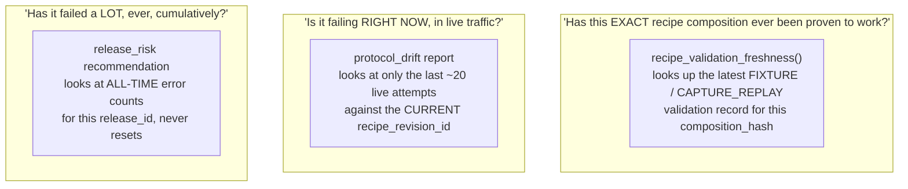

Why three, not one:

- **`release_risk`** is the oldest signal. Its weakness: a release with 3 `OPERATION_NOT_FOUND` failures from months ago stays flagged `QUARANTINE_RECOMMENDED` forever, even if it's been perfectly healthy since — and conversely, a release that *just* started failing badly is diluted by a long healthy history and might not cross the lifetime threshold for a while.
- **`protocol_drift`** fixes the recency problem: it only looks at a small recent window, so "this used to work and just stopped" is detectable immediately, and old, resolved incidents stop being counted after they age out of the window. It also checks `recipe_validation_freshness` as one of its inputs — if the currently-running composition has never been validated at all, that alone counts as drift.
- **`recipe_validation_freshness`** answers something neither of the others can: not "did live traffic succeed," but "did anyone ever *deliberately test* this exact byte-for-byte composition." A recipe can have zero live failures simply because nobody has run it yet, and freshness is what catches that.

All three are exposed in health reports, `/api/metrics`, and `run_supervisor_check.py` — as **non-blocking warnings**, deliberately. None of them halts task execution automatically; they're operator signals, not hard gates (the one exception is a full `QUARANTINE_RECOMMENDED` release-health flag, which does block new task execution — see §6).

A fourth field, `search_route_monitoring`, is *not* a new independent signal — it's a presentation layer over `release_risk` and the per-route failure-rate recommendations already computed for network health, scoped down to whichever single network context the worker is actually configured to use. It exists so an operator watching the one approved production route doesn't have to mentally cross-reference two other panels to answer "is the route I actually care about okay right now."

---

## 6. Releasing a New Protocol Recipe — the Promotion Safety Gate

Before a release can be approved for production use, `build_promotion_safety_report()` runs seven checks, **in this order**:

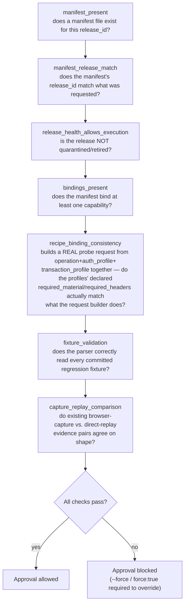

Every `check`/`approve` run also persists **first-class validation records** — one row per (capability binding × validation type) — in a `recipe_validation_record` table, capturing `release_id`, `recipe_revision_id`, `composition_hash`, `runtime_version`, `ok`, and a summary. This is the data `recipe_validation_freshness()` (§5) reads back later.

Every approval — normal, blocked, or forced — also writes a redacted `RELEASE_PROMOTION_AUDIT` JSON package to disk: the release ID, exact manifest path, approval pointer before/after, the full safety report, whether it was forced, and the operator's stated reason. No raw secrets, no raw evidence bodies.

---

## 7. Diagnosing a Failure — the Investigation Package

When a task fails, an operator can request an investigation package (`POST /api/tasks/{task_id}/investigate`, or the CLI failed-task export). It bundles everything needed to diagnose the failure without re-running anything:

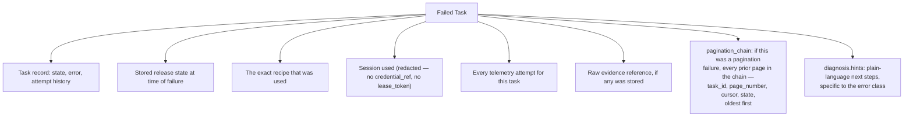

The `pagination_chain` field is always present (empty for non-pagination failures), so consumers don't need to branch on whether the failure was pagination-related — they can always look.

Support exports (`run_failed_task_export.py`, `POST /api/tasks/{task_id}/export`) wrap this same package and write it to a redacted JSON file operators can hand off, with retention controls.

---

## 8. Operator Tooling Map

```mermaid
flowchart TD
    subgraph Processes["Long-running processes"]
        WEB[run_app.py<br/>web API + frontend]
        WORKER[run_worker.py<br/>consumes Redis, executes tasks]
        DISPATCH[run_dispatcher.py<br/>Postgres outbox -> Redis]
    end
    subgraph OneShot["One-shot operational commands"]
        MIG1[run_migrations.py<br/>SQLite schema]
        MIG2[run_postgres_migrations.py<br/>Postgres schema]
        PRE[run_preflight.py<br/>is everything reachable + healthy?]
        START[run_startup_check.py<br/>are directories writable?]
        SMOKE[run_smoke.py<br/>submit a real task, wait for it]
        HEALTH[run_health_report.py<br/>full JSON snapshot to disk]
        SUP[run_supervisor_check.py<br/>PASS/WARN/FAIL gate for deployment]
        OUT[run_outbox.py<br/>inspect / drain / reconcile]
        REL[run_releases.py<br/>list / check / approve releases]
        VAL[run_protocol_validation.py<br/>fixture + capture/replay validation]
        SESS[run_sessions.py<br/>session registry import/list]
        ACT[run_task_actions.py<br/>list operator-actionable failed tasks]
        EXP[run_failed_task_export.py<br/>write a support package]
    end
    LAUNCH[run_all.ps1] -->|starts + supervises| WEB
    LAUNCH --> WORKER
    LAUNCH --> DISPATCH
    LAUNCH -->|runs first| MIG1
    LAUNCH --> MIG2
    LAUNCH -->|then verifies| PRE
```

`run_all.ps1` is the local one-command launcher: starts Docker Compose (Postgres + Redis), runs both migration runners, starts all three long-running processes directly (not through an intermediate shell, so their PIDs are tracked accurately), then runs a live preflight check. `run_all.ps1 -Stop` tears everything down; `-Restart` does both in sequence. It also sweeps for orphaned processes from prior runs on every start/stop, a defense added after a real bug where stopped processes weren't actually being killed.

---

## 9. Data Model Summary

**PostgreSQL** (the durable authority):

| Table | Purpose |
|---|---|
| `capability_tasks` | One row per unit of work. State, lease, attempt count, request/plan/result/error JSON. |
| `outbox_events` | One row per "this task needs a delivery published." FK to `capability_tasks`. |

**Redis** (reconstructable delivery infrastructure, never authoritative):

| Structure | Purpose |
|---|---|
| Stream `xingestion:capability-tasks` | Task IDs waiting for a worker. |
| Consumer group `capability-workers` | Tracks which worker has which delivery, enables `XAUTOCLAIM` reclaim. |

**SQLite** (`data/tasks.sqlite3`, everything that doesn't need Postgres-grade concurrency):

| Table (owning module) | Purpose |
|---|---|
| `canonical_tweets`, `engagement_observations` (`canonical/store.py`) | The actual scraped data. |
| `protocol_attempts` (`telemetry/store.py`) | Every live attempt against X: state, error class, duration, session, network context. |
| `recipe_validation_record` (`releases/validation_records.py`) | Every FIXTURE/CAPTURE_REPLAY validation run, keyed by composition_hash. |
| `protocol_release_health`, `approved_protocol_release` (`releases/store.py`) | Which release is approved, and its operator-set health. |
| Sessions table (`sessions/`) | Session metadata, health, leases — never raw secrets, only credential references. |

---

## 10. Where to Look Next

- **`FINAL_PRODUCT_SPEC.md`** — the complete intended product; this document explains only what's actually built against it.
- **`docs/CURRENT_STAGE.md`** — a point-in-time coverage summary against the spec, with an explicit "what should not be claimed yet" section.
- **`docs/TASKS.md`** — the live checklist of remaining work, including spec-flagged gaps this document's system doesn't yet cover (monitoring subscriptions, a genuinely external northbound API, broader canonical entities beyond tweets, and more — see that file for the full list).
- **`docs/WORKLOG.md`** — the chronological build history, checkpoint by checkpoint, including what broke and how it was fixed.
- **`docs/deployment_runbook.md`** — exact commands for every operation mentioned above.
- **`docs/process_supervision.md`** — supervisor check details for a hosted/always-on deployment.
